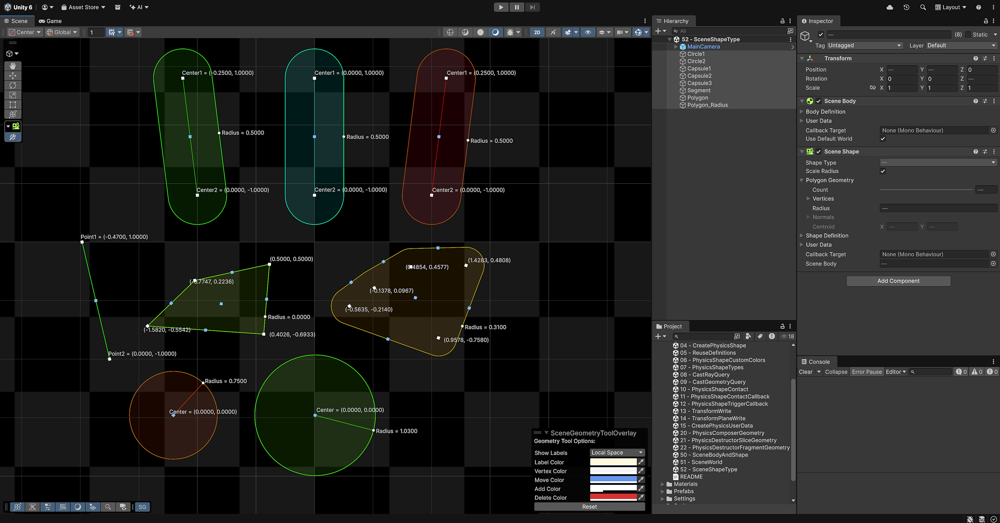
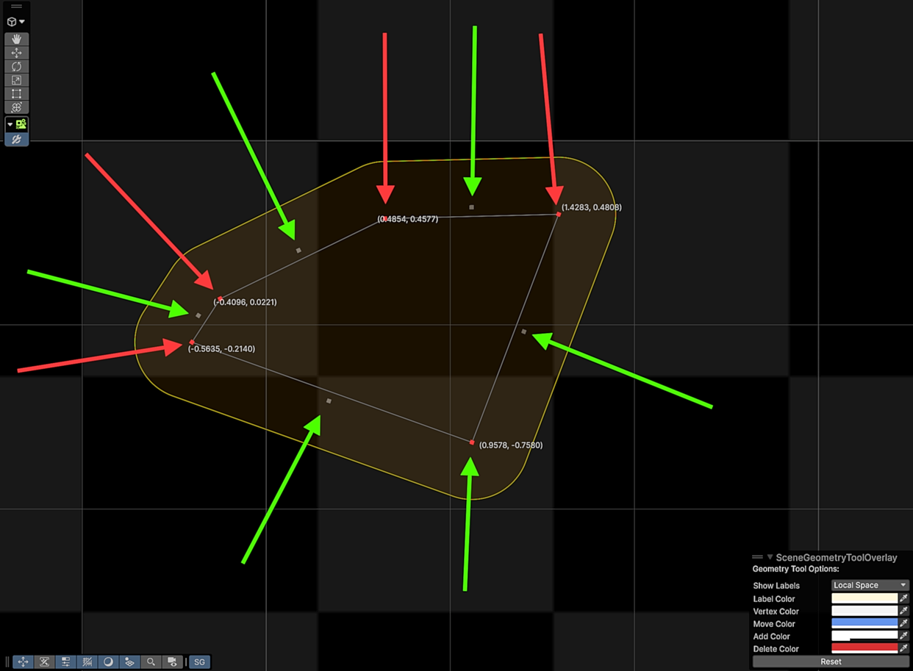

# Physics 2D LowLevel "Primer" Examples

The following examples are provided to give a good start in understanding some of the more important features provided by the low-level Physics API and the "extras" test package provided.
Below will add any extra detail not covered in the examples themselves.

Each example has at least a single "Example" GameObject with an example script which you should examine to understand how the example works.
The scripts contain short annotation-style comments where appropriate to highlight the functionality.

<b>Note:</b> Gaps in the example numbering is intentional, leaving space for addition examples to be added.

---
## 01 - Create Physics World
This example demonstrates creating and destroying a `PhysicsWorld` which is completely isolated from other `PhysicsWorld.

---
## 02 - Use Default Physics World
Whilst it is powerful to be able to create your own isolated `PhysicsWorld`, it is more common to use a single `PhysicsWorld` which is why Unity automatically creates one for you.
This example shows you how you access the default world.

---
## 03 - Create Physics Body
This example shows you how to create a `PhysicsBody` in a `PhysicsWorld`.

---
## 04 - Create Physics Shape
This example shows you how to create a `PhysicsShape` on a `PhysicsBody`.

---
## 05 - Reuse Definitions
This example goes into more detail showing you how you can/should reuse definitions when creating object types.

---
## 06 - Physics Shape Custom Colors
This example shows how you can select a custom color for each `PhysicsShape` which is useful when using the debug renderer.
A custom color is specified in the shapes `SurfaceMaterial` along with its physics-based properties such as Friction, Bounciness etc.

---
## 07 - Physics Shape Types
This example shows the main primitive types of shapes, each with their own geometry type.

---
## 08 - Cast Ray Query
This example shows you how to use one of the many queries available, in this case, using CastRay.

---
## 09 - Cast Geometry Query
This example shows you how to use the geometry query to cast geometry through the world, detecting its contents.

---
## 10 - Physics Shape Contact
This example shows you the basics of configuring how `PhysicsShape` come into contact and how events are produced.

---
## 11 - Physics Shape Contact Callback
This example shows you the basics of configuring a script callback when a pair of `PhysicsShape` come into contact.

---
## 12 - Physics Shape Trigger Callback
This example shows you the basics of configuring a script callback when a pair of `PhysicsShape` overlap when either of the pair are a trigger.

---
## 13 - Physics Shape Contact Filtering
This example shows you the basics of configuring how `PhysicsShape` come into contact but also how to intercept contact processing to stop contacts being created.

---
## 14 - Transform Write
This example shows you how to control if and how a `PhysicsBody` writes to a specific Unity Transform.

---
## 15 - Transform Plane Write
This example shows you how to configure the `PhysicsWorld` so that it writes to a selected 3D Transform plane rather than always the XY plane.

---
## 16 - Physics User Data
Physics user data is not used by the physics system but allows you to get/set it to multiple objects for your own customisable purposes.

This example shows you how to create and assign `PhysicsUserData` to a `PhysicsBody` and `PhysicsShape` although it is available to multiple objects types of:
- PhysicsWorld
- PhysicsBody
- PhysicsShape
- PhysicsChain
- PhysicJoint (all)

---
##17 - Physics Query Job
Whilst a majority of the API can be used in a C# Job, this examples specifically shows you can use queries in a C# Job.

---

---

---
## 20 - Physics Composer Geometry
This example shows the basics of how to use the `PhysicsComposer` to add geometry to layers, specifying order and operation and producing polygon or chain output which can then be used to create `PhysicsShape`.

---
## 21 - Physics Destructor Slice Geometry
This example shows the basics of how to use the `PhysicsDestructor.Slice` to slice geometry in two, producing Polygon geometry which can then be used to create `PhysicsShape`.

---
## 22 - Physics Destructor Fragment Geometry
This example shows the basics of how to use the `PhysicsDestructor.Fragment` to fragment geometry using fragment points, producing Polygon geometry which can then be used to create `PhysicsShape`.

---
## 23 - Physics Destructor Fragment Mask Geometry
This example shows the basics of how to use the `PhysicsDestructor.Fragment` to fragment geometry using fragment points but where a geometry mask is applied, producing Polygon geometry which can then be used to create `PhysicsShape`.
The option of using a mask in this example over the example 22 is that the target geometry first has a mask geometry removed (known as "carving") and that is returned as "unbroken" geometry.
The geometry removed by the mask is then the geometry that is fractured which is returned as "broken" geometry.
The net result is that the target geometry has a mask carved from it with the carved region then being fractured which effectively acts as if a region was broken from the target geometry.

---

---

---

# Low Level Extras Package

The following examples show how to use the test package `com.unity.2d.physics.lowlevelextras`.

This package is an example-only package which wraps the API you've seen so far into Unity components.
It is not designed to be used in production projects however you are free to do so if you wish.
Most editing of properties can only be done in Edit mode as the components are only examples and are not fully featured.
It exposes most features for each object type and allows editing their configuration in the inspector.

For `PhysicsShape` components, scene tooling is available allowing you to edit geometry visually which this also supports multiple `TransformPlane` editing.

The main aim for these components is to demonstrate how you can create your own components using the API which is why they expose definitions, callback-targets, user-data etc.

All components begin with a "Scene" prefix and can be found in the component menu `Physics 2D > LowLevel`:

- SceneWorld - Wraps ` PhysicsWorld` allowing you to select either the default world or a custom world. 
- SceneBody - Wraps a `PhysicsBody` allowing you to create them in a world.
- SceneShape - Wraps a single `PhysicsShape` allowing you to select the shape type.
- SceneOutlineShape - Wraps multiple `PhysicsShape` created from an editable concave/convex outline (identical to the [PolygonCollider2D](https://docs.unity3d.com/6000.3/Documentation/ScriptReference/PolygonCollider2D.html))
- SceneSpriteShape - Wraps multiple `PhysicsShape` created from a selected [Sprite](https://docs.unity3d.com/6000.3/Documentation/ScriptReference/Sprite.html).
- SceneChain - Wraps a `PhysicsChain`.
- Joints
  - SceneDistanceJoint - Wraps a `PhysicsDistanceJoint` (similar to the [DistanceJoint2D](https://docs.unity3d.com/6000.3/Documentation/ScriptReference/DistanceJoint2D.html))
  - SceneFixedJoint - Wraps a `PhysicsFixedJoint` (similar to the [FixedJoint2D](https://docs.unity3d.com/6000.3/Documentation/ScriptReference/FixedJoint2D.html))
  - SceneHingeJoint - Wraps a `PhysicsHingeJoint` (similar to the [HingeJoint2D](https://docs.unity3d.com/6000.3/Documentation/ScriptReference/HingeJoint2D.html))
  - SceneIgnoreJoint - Wraps a `PhysicsIgnoreJoint`
  - SceneRelativeJoint - Wraps a `PhysicsRelativeJoint` (similar to the [RelativeJoint2D](https://docs.unity3d.com/6000.3/Documentation/ScriptReference/RelativeJoint2D.html))
  - SceneSliderJoint - Wraps a `PhysicsSliderJoint` (similar to the [SliderJoint2D](https://docs.unity3d.com/6000.3/Documentation/ScriptReference/SliderJoint2D.html))
  - SceneWheelJoint - Wraps a `PhysicsWheelJoint` (similar to the [WheelJoint2D](https://docs.unity3d.com/6000.3/Documentation/ScriptReference/WheelJoint2D.html))

---
## 50 - Scene Body And Shape
This example shows how to create a body with a shape attached to it.

The `SceneBody` exposes:
- The `PhysicsBodyDefinition` used to create the body
- `PhysicsUserData` assigned to `PhysicsBody.userData`
- The callback target for event callbacks assigned to `PhysicsBody.callbackTarget`
- The ability to use the default world via the "Use Default World" checkbox. When unchecked, you can select a specific `SceneWorld` component.

The `PhysicsShape` exposes:
- The `PhysicsShapeDefinition` used to create the shape.
- `PhysicsUserData` assigned to `PhysicsShape.userData`
- The callback target for event callbacks assigned to `PhysicsShape.callbackTarget`
- The specific `SceneBody` to create the shape on. For convenience, this is automatically populated by searching the current parent hierarchy for a `SceneBody`. Without it, a shape cannot be created.

---
## 51 - Scene World
This example is identical to example "50" in that it creates a body with a shape attached to it.
The difference with this example is that there is a new GameObject with a `SceneWorld` component and the `SceneBody` has its "Use Default World" disabled and has selected the `SceneWorld` component on the `MyWorld` GameObject.
The result of this is that the `SceneBody` is created in the `PhysicsWorld` the `SceneWorld` component creates.

This means you can have multiple worlds and multiple objects within those worlds in a single Unity scene if you wish.
Whilst the `SceneBody` is connected to the `SceneWorld`, you can configure the `SceneWorld` to simply represent the default world by enabling its "Use Default World" checkbox.
Multiple `SceneWorld` using the default world all represent the same default world that Unity implicitly creates.
Only with that option disabled does the `SceneWorld` create a `PhysicsWorld`.

The `SceneWorld` component also provides an extra fold-out in the inspector named "Info" in which it displays the world `Profile` (timings) and world `counters`.
When the fold-out is open, the `SceneWorld` will retrieve these by calling [PhysicsWorld.profile](https://docs.unity3d.com/6000.3/Documentation/ScriptReference/LowLevelPhysics2D.PhysicsWorld-profile.html) amd [PhysicsWorld.counters](https://docs.unity3d.com/6000.3/Documentation/ScriptReference/LowLevelPhysics2D.PhysicsWorld-counters.html). 
This also displays information related to the `PhysicsWorld` the `SceneWorld` is related to i.e. the default world or the world it created.
This can be useful in simply looking at the default world information by adding a GameObject with a single `SceneWorld` with the `Use Default World` property enabled.
The fold-out looks like this:

---
## 52 Scene Shape Type
This example simply demonstrates show a `SceneShape` allows you to select the shape type you want.
When you do that, the Editor inspector changes to allow you to edit that.
If you select the "Scene" view with the "Example" GameObject selected, you will also see that there is tooling available to edit the shapes directly in the scene view.

Seen above, you can drag the “cube” handles to move vertices around and drag the “sphere” handles to change a shape radius.
The current values are shown as labels however you can turn that on/off using the “SceneShape Options” overlay shown above which are also persisted for you.
You can also configure the colors shown if you wish.
Note that there’s a light-blue “cube” handle that allows you to move all the vertices together, removing the need to move each vertex individually.
Be careful using this as this is not the same as the body position and is essentially offsetting the geometry relative to the body position.

When editing a SceneShape set to Polygon geometry, you can move the existing vertices by dragging the cube handles (shown with white arrows below).
You can also move an edge (two vertices) together by dragging the cube handles (shown with cyan arrows below).
You can also change the radius of the polygon geometry by dragging the sphere handle (shown with the yellow arrow below).

If you press the “shift” key, you can then add or remove vertices. When you press the "shift" key, the existing vertices change color (to the “Delete Color” preference) and clicking on one deletes that vertex.
Additionally, new vertices appear in between the current vertices (shown as the “Add Color” preference) and clicking on one adds that vertex.
As shown below, pressing the “shift” key results in the vertex delete (red arrows) and new  vertices (green arrows) being available.

---
## 53 - Scene Shape Bounce
This example shows a basic setup with a Static "Ground" box and a Dynamic "Ball".
- The "Ground" uses a `SceneBody` set to a `Static` body-type, set in the `Body Definition`.
- The "Ball" uses a `SceneBody` set to a `Dynamic` body-type, set in the `Body Definition`.
- The "Ball" also sets its `Shape Definition > Surface Material > Bounciness" to `1` which results in full bounciness.

Press "Play" and the "ball" should continue to bounce on the "ground".

---
## 54 - Scene Distance Joint
This example shows the `SceneDistanceJoint` which creates a `PhysicsDistanceJoint` however this example could be any joint and what it shows applies to all joints.
- The "Ground" uses a `SceneBody` set to a `Kinematic` body-type with an angular velocity of 60-degrees/sec, both set in the `Body Definition`. This causes it to rotate.
- The "Ball" uses a `SceneBody` set to a `Dynamic` body-type, set in the `Body Definition`.
- The "Ball" also has a `SceneDistanceJoint` which constraint both the "Ground" and "Ball" `SceneBody`. The `JointDefinition` is used to configure the dynamics of the joint.

Press "Play" and the "ground" will rotate with the "ball" constrained by distance to the "ground". Because the "ground" is rotating, the "ball" bounces at different angles on each contact. Eventually the "ball" will slow and stop bouncing.

---
## WIP

