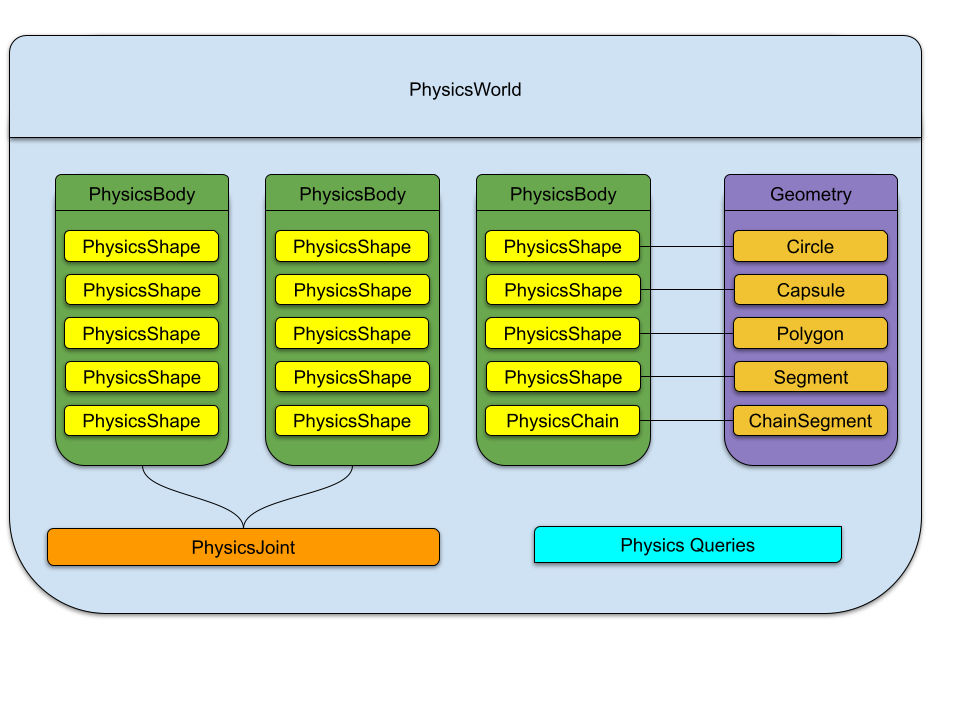

# Overview

Unity’s **low-level 2D physics system** delivers both speed and flexibility.
You can leverage it to create physics objects directly in your scene, or by designing custom components for your GameObjects that manage these physics objects.
All related APIs are available under the **`UnityEngine.LowLevelPhysics2D`** namespace.

To begin, take a look at the **`PhysicsWorld`** type in the [scripting documentation](https://docs.unity3d.com/6000.3/Documentation/ScriptReference/LowLevelPhysics2D.PhysicsWorld.html).

---

## How Physics Objects Work

The low-level physics API uses a powerful, multithreaded physics system which doesn't rely on GameObjects or Components, although it has support to interoperate with them in critical areas such as writing to `Transform`, performing callbacks to `MonoBehaviour`etc.

This means:
- Physics objects don't appear in the Unity Editor's Inspector by default.
- You can use them in your scripts, creating custom components, allowing you to set up and configure them in the Inspector.
- All API types are `structs` (simple data structures), and many can be saved and edited in the Inspector.

Even though you interact with these objects in an easy-to-understand, object-oriented way (like creating and destroying them), behind the scenes, everything is stored contiguously in memory for better performance.

**Handles Explained:**
- When you create a physics object in C#, you are returned a `read-only struct` type such as `PhysicsBody` or `PhysicsShape` that represents the object, it actually acts like a small tag (a 64-bit "handle") referring to the actual object stored in the engine.
- You don't usually need to worry about this handle, as the API uses it automatically when you perform actions with the physics object.
- **Benefit**: Handles are small, so they can be passed around very quickly, even in multithreaded C# Jobs.
- **Benefit**: Since all API types are `structs`, they can be stored in "native containers," which are efficient memory structures usable with C# Jobs.

**Object Lifetime:**
- If an object is removed (destroyed), its handle becomes invalid. You can check if any object handle is valid by reading its `isValid` property.
- If you try to use an invalid handle, you'll see a clear error message in the console indicating which object and what you attempted.
- The same applies if you provide incorrect values to any method – a clear error message will appear.

**How Handles are Structured (Optional Detail):**
- Every object handle contains at least an "index" (where it's stored) and a "generation" number.
- The "generation" increases each time that storage spot is reused after an object is destroyed. This helps prevent using old, invalid handles.
- The `PhysicsWorld` also has such a handle.
- Other objects within a `PhysicsWorld` have an additional "world-index" to show which world they belong to.
- No physics object `struct` is larger than 64 bits, making them very compact.

---

## Multi-threading Support

Most of the API is designed to be **thread-safe**, meaning you can perform both read and write operations from different threads without issues.

**How it Works (WORM Lock System):**
- The system uses a "Write-Once / Read-Many" (WORM) locking mechanism.
- You can perform many read operations at the same time, in parallel.
- Only one thread can perform a write operation at a time on any `PhysicsWorld`.
- When a write operation is requested, the system briefly pauses new reads from being serviced, finishes any ongoing reads, performs the requested write, and then allows reads again. This process has very little impact on performance.
- This feature is a huge advantage, allowing you to use most of the API in C# Jobs for better performance.

**Important Note on Create/Destroy Methods:**
- Currently, `Create`, `CreateBatch`, `Destroy`, and `DestroyBatch` methods are **not** marked as thread-safe in this initial release. This means you can only use them on the main thread.
- This isn't a technical limitation; they are inherently thread-safe. However, we are being cautious to prevent potential "deadlocks" (where threads get stuck waiting for each other).
- We are working on solutions to help avoid deadlocks for these methods in the future.
- Creating and destroying objects off the main thread is not a common scenario, especially since these are "write" operations.

**World-Specific Locking:**
- Locking happens per `PhysicsWorld`. This means you can perform write operations on different `PhysicsWorld` instances at the same time without conflicts.

---

## Data Handling & Memory (Garbage Collection)

The API is "GC friendly," meaning it avoids creating temporary C# memory allocations that the Garbage Collector (GC) would need to clean up. This helps maintain smooth performance.

**How Memory is Managed:**
- All memory is allocated directly within the engine, not on the C# heap.
- Objects are returned to C# as `read-only structs` containing only a 64-bit handle.
- The only other allocations happen when methods return or accept a collection of values, which use `NativeArray<T>` and `ReadOnlySpan<T>` depending on the operation.

When you get results from a query (like `PhysicsWorld.CastRay`), they are provided in a `NativeArray<T>` which needs to be disposed when you're done with it as per the following examples.

**Example: Manual Disposal**
```csharp
void Run()
{
    // ...
    // Perform a query.
    var results = world.CastRay(<args>);

    // ... do some work with results ...

    // You MUST release the results when done.
    results.Dispose(); 
}
```

**Example: Automatic Disposal with `using` (Recommended for `Temp` or `TempJob` allocators)**

For temporary results, C# offers a safer way to ensure disposal with the `using` statement:
```csharp
void Run()
{
    // ...
    // Perform a query, and 'results' will automatically be disposed when 'Run' exits.
    using var results = world.CastRay(<args>); 

    // ... do some work with results ...
    
    // When "Run" finishes, results will be disposed automatically.
}
```

**Controlling Memory Allocation:**

All operations that return multiple results allow you to choose how the memory is allocated using: `Temp`, `TempJob`, or `Persistent` with `Temp` being the default.

**Example: Persistent Allocation**

Whilst not as common, you are free to allocator the memory as persistent so that the information can persist over as many frames as you require.
Persistent allocation is much slower than `Temp` or `TempJob` allocation so should only be used if you require the information over many frames.
Care must also be taken to ensure you eventually dispose of the allocation, otherwise you will encounter a memory leak warning when exiting play mode.

```csharp
    void Run()
    {
        // ...
        // Perform a query and allocate memory that persists across many frames.
        // Remember to dispose of 'results' manually when using Persistent!
        var results = world.CastRay(<args>, Allocator.Persistent); 

        // ... do some work ...
    }
```

**Accessing Events with `ReadOnlySpan<T>` (Direct Memory Access):**

When getting events (such as `contactBeginEvents`), you're accessing memory directly from the engine using `ReadOnlySpan<T>` which results in rapid access to the data.

**Example: Iterating Events**
```csharp
void Run()
{
    // ...
    // Iterate through current contact begin events.
    // NOTE: These do NOT require disposal, as they are direct memory access.
    foreach(var evt in world.contactBeginEvents)
        Debug.Log($"{evt.shapeA} hit {evt.shapeB}");
}
```
**Caution**: Because you're directly accessing memory, **do not perform any write operations** (such as destroying a physics object) while iterating through a `ReadOnlySpan<T>` event list. Doing so can cause crashes or at least invalid returned data.

**Alternative**: For safer event handling, consider using **callbacks**, which process events for you and send them to the objects you choose.

---

## Important Features

Here are some key features of the low-level 2D physics system:

- **Structured Physics Objects**:
  - 
  - [PhysicsWorld](https://docs.unity3d.com/6000.3/Documentation/ScriptReference/LowLevelPhysics2D.PhysicsWorld.html) representing an isolated simulation container.
  - [PhysicsBody](https://docs.unity3d.com/6000.3/Documentation/ScriptReference/LowLevelPhysics2D.PhysicsBody.html) representing a position and rotation in the `PhysicsWorld` and additional behaviours.
  - [PhysicsShape](https://docs.unity3d.com/6000.3/Documentation/ScriptReference/LowLevelPhysics2D.PhysicsShape.html) representing an area relative to a `PhysicsBody` and additional behaviours.
  - [PhysicsChain](https://docs.unity3d.com/6000.3/Documentation/ScriptReference/LowLevelPhysics2D.PhysicsChain.html) representing a chain of line segment `PhysicsShape` that form a continuous surface.
  - [PhysicsJoint](https://docs.unity3d.com/6000.3/Documentation/ScriptReference/LowLevelPhysics2D.PhysicsJoint.html) the base of a set of joints available to constraint pairs of `PhysicsBody`.


- **Performance and Parallelism**:
  - **Simulation Workers** - Control how many extra worker threads (0 to 63) are used to simulate each world via [PhysicsWorld.simulationWorkers](https://docs.unity3d.com/6000.3/Documentation/ScriptReference/LowLevelPhysics2D.PhysicsWorld-simulationWorkers.html). This value is limited by your device's available threads. Even on single-threaded platforms like WebGL, main-thread performance has improved significantly.
  - **Concurrent Simulations** - Simulate multiple `PhysicsWorld` instances at the same time using [PhysicsWorld.concurrentSimulations](https://docs.unity3d.com/6000.3/Documentation/ScriptReference/LowLevelPhysics2D.PhysicsWorld-concurrentSimulations.html).

- **Enhanced Layers**:
  - Instead of the standard 32 layers, you can now use up to 64 layers for collision detection and queries using [PhysicsMask](https://docs.unity3d.com/6000.3/Documentation/ScriptReference/LowLevelPhysics2D.PhysicsMask.html), [PhysicsLayers](https://docs.unity3d.com/6000.3/Documentation/ScriptReference/LowLevelPhysics2D.PhysicsLayers.html) and [PhysicsWorld.useFullLayers](https://docs.unity3d.com/6000.3/Documentation/ScriptReference/LowLevelPhysics2D.PhysicsWorld-useFullLayers.html).

- **Dedicated Physics Types**:
  - [PhysicsTransform](https://docs.unity3d.com/6000.3/Documentation/ScriptReference/LowLevelPhysics2D.PhysicsTransform.html): Manages an object's position and rotation (three degrees of freedom).
  - [PhysicsRotate](https://docs.unity3d.com/6000.3/Documentation/ScriptReference/LowLevelPhysics2D.PhysicsRotate.html): Handles single-axis rotation (part of `PhysicsTransform`).
  - [PhysicsLayers](https://docs.unity3d.com/6000.3/Documentation/ScriptReference/LowLevelPhysics2D.PhysicsLayers.html): Manages 64 named layers, similar to Unity's `LayerMask` but for 64 bits.
  - [PhysicsMask](https://docs.unity3d.com/6000.3/Documentation/ScriptReference/LowLevelPhysics2D.PhysicsMask.html): Used for 64-bit masking in layers, contact control, and queries (comes with a new `Mask64Field` UI type).
  - [PhysicsAABB](https://docs.unity3d.com/6000.3/Documentation/ScriptReference/LowLevelPhysics2D.PhysicsAABB.html): Defines 2D axis-aligned bounding boxes.
  - [PhysicsPlane](https://docs.unity3d.com/6000.3/Documentation/ScriptReference/LowLevelPhysics2D.PhysicsPlane.html): Represents a 2D plane (limited use for now).

- **Event System (Direct Access)**:
  - These events are accessed directly from memory as `ReadOnlySpan<T>`:
    - [PhysicsEvents.PreSimulate](https://docs.unity3d.com/6000.3/Documentation/ScriptReference/LowLevelPhysics2D.PhysicsEvents.PreSimulate.html): Called before any simulation step on a `PhysicsWorld`.
    - [PhysicsEvents.PostSimulate](https://docs.unity3d.com/6000.3/Documentation/ScriptReference/LowLevelPhysics2D.PhysicsEvents.PostSimulate.html): Called after any simulation step on a `PhysicsWorld`.
    - [PhysicsWorld.bodyUpdateEvents](https://docs.unity3d.com/6000.3/Documentation/ScriptReference/LowLevelPhysics2D.PhysicsWorld-bodyUpdateEvents.html): When a `PhysicsBody` is updated or goes to sleep.
    - [PhysicsWorld.contactHitEvents](https://docs.unity3d.com/6000.3/Documentation/ScriptReference/LowLevelPhysics2D.PhysicsWorld-contactHitEvents.html): When two `PhysicsShape` objects collide above a certain speed.
    - [PhysicsWorld.contactBeginEvents](https://docs.unity3d.com/6000.3/Documentation/ScriptReference/LowLevelPhysics2D.PhysicsWorld-contactBeginEvents.html): When two `PhysicsShape` objects start touching.
    - [PhysicsWorld.contactEndEvents](https://docs.unity3d.com/6000.3/Documentation/ScriptReference/LowLevelPhysics2D.PhysicsWorld-contactEndEvents.html): When two `PhysicsShape` objects stop touching.
    - [PhysicsWorld.triggerBeginEvents](https://docs.unity3d.com/6000.3/Documentation/ScriptReference/LowLevelPhysics2D.PhysicsWorld-triggerBeginEvents.html): When two `PhysicsShape` objects (one being a [trigger](https://docs.unity3d.com/6000.3/Documentation/ScriptReference/LowLevelPhysics2D.PhysicsShape-isTrigger.html)) start overlapping.
    - [PhysicsWorld.triggerEndEvents](https://docs.unity3d.com/6000.3/Documentation/ScriptReference/LowLevelPhysics2D.PhysicsWorld-triggerEndEvents.html): When two `PhysicsShape` objects (one being a [trigger](https://docs.unity3d.com/6000.3/Documentation/ScriptReference/LowLevelPhysics2D.PhysicsShape-isTrigger.html)) stop overlapping.
    - [PhysicsWorld.jointThresholdEvents](https://docs.unity3d.com/6000.3/Documentation/ScriptReference/LowLevelPhysics2D.PhysicsWorld-jointThresholdEvents.html): When a `PhysicsJoint` exceeds its [force](https://docs.unity3d.com/6000.3/Documentation/ScriptReference/LowLevelPhysics2D.PhysicsJoint-forceThreshold.html) or [torque](https://docs.unity3d.com/6000.3/Documentation/ScriptReference/LowLevelPhysics2D.PhysicsJoint-torqueThreshold.html) threshold.

- **Callback System (MonoBehaviour Integration)**:
  - Callbacks send event notifications to specific [MonoBehaviour](https://docs.unity3d.com/6000.3/Documentation/ScriptReference/MonoBehaviour.html) objects if they implement certain interfaces.
  - Callback targets can be set using [.callbackTarget](https://docs.unity3d.com/6000.3/Documentation/ScriptReference/30_search.html?q=callbacktarget).
  - **Interfaces for Callbacks**:
    - [PhysicsCallbacks.IContactFilterCallback](https://docs.unity3d.com/6000.3/Documentation/ScriptReference/LowLevelPhysics2D.PhysicsCallbacks.IContactFilterCallback.html): Control if a contact is allowed.
    - [PhysicsCallbacks.IPreSolveCallback](https://docs.unity3d.com/6000.3/Documentation/ScriptReference/LowLevelPhysics2D.PhysicsCallbacks.IPreSolveCallback.html): Control if a contact is enabled before solving.
    - [PhysicsCallbacks.IBodyUpdateCallback](https://docs.unity3d.com/6000.3/Documentation/ScriptReference/LowLevelPhysics2D.PhysicsCallbacks.IBodyUpdateCallback.html): Notified when a `PhysicsBody` updates or sleeps.
    - [PhysicsCallbacks.IContactCallback](https://docs.unity3d.com/6000.3/Documentation/ScriptReference/LowLevelPhysics2D.PhysicsCallbacks.IContactCallback.html): Notified of both contact start and end.
    - [PhysicsCallbacks.ITriggerCallback](https://docs.unity3d.com/6000.3/Documentation/ScriptReference/LowLevelPhysics2D.PhysicsCallbacks.ITriggerCallback.html): Notified of both trigger start and end.
    - [PhysicsCallbacks.IJointThresholdCallback](https://docs.unity3d.com/6000.3/Documentation/ScriptReference/LowLevelPhysics2D.PhysicsCallbacks.IJointThresholdCallback.html): Notified when a `PhysicsJoint` exceeds its [force](https://docs.unity3d.com/6000.3/Documentation/ScriptReference/LowLevelPhysics2D.PhysicsJoint-forceThreshold.html) or [torque](https://docs.unity3d.com/6000.3/Documentation/ScriptReference/LowLevelPhysics2D.PhysicsJoint-torqueThreshold.html) thresholds.
    - **Automatic Callbacks**: You can enable automatic sending of these event-related callbacks per world using properties using:
      - [PhysicsWorld.autoBodyUpdateCallbacks](https://docs.unity3d.com/6000.3/Documentation/ScriptReference/LowLevelPhysics2D.PhysicsWorld-autoBodyUpdateCallbacks.html)
      - [PhysicsWorld.autoContactCallbacks](https://docs.unity3d.com/6000.3/Documentation/ScriptReference/LowLevelPhysics2D.PhysicsWorld-autoContactCallbacks.html)
      - [PhysicsWorld.autoTriggerCallbacks](https://docs.unity3d.com/6000.3/Documentation/ScriptReference/LowLevelPhysics2D.PhysicsWorld-autoTriggerCallbacks.html)
      - [PhysicsWorld.autoJointThresholdCallbacks](https://docs.unity3d.com/6000.3/Documentation/ScriptReference/LowLevelPhysics2D.PhysicsWorld-autoJointThresholdCallbacks.html)
    - **Manual Callbacks**: You can also manually trigger all or specific callbacks at any time using:
      - [PhysicsWorld.sendAllCallbacks()](https://docs.unity3d.com/6000.3/Documentation/ScriptReference/LowLevelPhysics2D.PhysicsWorld-sendAllCallbacks.html)
      - [PhysicsWorld.sendBodyUpdateCallbacks()](https://docs.unity3d.com/6000.3/Documentation/ScriptReference/LowLevelPhysics2D.PhysicsWorld-sendBodyUpdateCallbacks.html)
      - [PhysicsWorld.sendContactCallbacks()](https://docs.unity3d.com/6000.3/Documentation/ScriptReference/LowLevelPhysics2D.PhysicsWorld-sendContactCallbacks.html)
      - [PhysicsWorld.sendTriggerCallbacks()](https://docs.unity3d.com/6000.3/Documentation/ScriptReference/LowLevelPhysics2D.PhysicsWorld-sendTriggerCallbacks.html)
      - [PhysicsWorld.sendJointThresholdCallbacks()](https://docs.unity3d.com/6000.3/Documentation/ScriptReference/LowLevelPhysics2D.PhysicsWorld-sendJointThresholdCallbacks.html)

- **Custom 2D Planes**:
  - You can work with 2D planes other than the standard XY plane, such as [PhysicsWorld.TransformPlane.XZ](https://docs.unity3d.com/6000.3/Documentation/ScriptReference/LowLevelPhysics2D.PhysicsWorld.TransformPlane.XZ.html)  (common in 3D).
  - Each `PhysicsWorld` can be configured for a specific [TransformPlane](https://docs.unity3d.com/6000.3/Documentation/ScriptReference/LowLevelPhysics2D.PhysicsWorld.TransformPlane.html) with [PhysicsWorld.transformPlane](https://docs.unity3d.com/6000.3/Documentation/ScriptReference/LowLevelPhysics2D.PhysicsWorld-transformPlane.html).
  - While the physics system works in the chosen plane, it still operates in a 2D space using `Vector2` therefore you will need to convert between `Vector2` and `Vector3` yourself.
  - **Helper Tools**: `PhysicsMath` provides many utilities for these conversions, such as:
    - [PhysicsMath.ToPhysicsTransform](https://docs.unity3d.com/6000.3/Documentation/ScriptReference/LowLevelPhysics2D.PhysicsMath.ToPhysicsTransform.html)
    - [PhysicsMath.ToPosition3D](https://docs.unity3d.com/6000.3/Documentation/ScriptReference/LowLevelPhysics2D.PhysicsMath.ToPosition3D.html)
    - [PhysicsMath.ToPosition2D](https://docs.unity3d.com/6000.3/Documentation/ScriptReference/LowLevelPhysics2D.PhysicsMath.ToPosition2D.html)
    - [PhysicsMath.ToRotation2D](https://docs.unity3d.com/6000.3/Documentation/ScriptReference/LowLevelPhysics2D.PhysicsMath.ToRotation2D.html)
    - [PhysicsMath.ToRotationFast3D](https://docs.unity3d.com/6000.3/Documentation/ScriptReference/LowLevelPhysics2D.PhysicsMath.ToRotationFast3D.html)
    - [PhysicsMath.ToRotationSlow2D](https://docs.unity3d.com/6000.3/Documentation/ScriptReference/LowLevelPhysics2D.PhysicsMath.ToRotationSlow3D.html)
    - [PhysicsMath.GetRotationAxes](https://docs.unity3d.com/6000.3/Documentation/ScriptReference/LowLevelPhysics2D.PhysicsMath.GetRotationAxes.html)
    - [PhysicsMath.GetTranslationAxes](https://docs.unity3d.com/6000.3/Documentation/ScriptReference/LowLevelPhysics2D.PhysicsMath.GetTranslationAxes.html)
- **Controlling Object Movement (Pose) Updates**:
  - You can control if and how the `PhysicsWorld` updates a Unity [Transform](https://docs.unity3d.com/6000.3/Documentation/ScriptReference/Transform.html) with the position and rotation (pose) of a `PhysicsBody`.
  - **World-level Control ([PhysicsWorld.transformWriteMode](https://docs.unity3d.com/6000.3/Documentation/ScriptReference/LowLevelPhysics2D.PhysicsWorld-transformWriteMode.html)):**
    - [TransformWriteMode.Off](https://docs.unity3d.com/6000.3/Documentation/ScriptReference/LowLevelPhysics2D.PhysicsWorld.TransformWriteMode.Off.html): Never writes transforms.
    - [TransformWriteMode.Fast2D](https://docs.unity3d.com/6000.3/Documentation/ScriptReference/LowLevelPhysics2D.PhysicsWorld.TransformWriteMode.Fast2D.html): Fast writing where rotation only affects the chosen [TransformPlane](https://docs.unity3d.com/6000.3/Documentation/ScriptReference/LowLevelPhysics2D.PhysicsWorld.TransformPlane.html) axis, and other axes are reset.
    - [TransformWriteMode.Slow3D](https://docs.unity3d.com/6000.3/Documentation/ScriptReference/LowLevelPhysics2D.PhysicsWorld.TransformWriteMode.Slow3D.html): Slower writing where rotation affects the chosen [TransformPlane](https://docs.unity3d.com/6000.3/Documentation/ScriptReference/LowLevelPhysics2D.PhysicsWorld.TransformPlane.html) axis, but other axes remain unchanged.
    - **Body-level Control ([PhysicsBody.transformWriteMode](https://docs.unity3d.com/6000.3/Documentation/ScriptReference/LowLevelPhysics2D.PhysicsBody-transformWriteMode.html)):**
      - A `PhysicsBody` will only write to a Unity [Transform](https://docs.unity3d.com/6000.3/Documentation/ScriptReference/Transform.html) if its [PhysicsBody.transformObject](https://docs.unity3d.com/6000.3/Documentation/ScriptReference/LowLevelPhysics2D.PhysicsBody-transformObject.html) property is set to a Unity [Transform](https://docs.unity3d.com/6000.3/Documentation/ScriptReference/Transform.html).
      - Each `PhysicsBody` can also decide how it wants to write to its [Transform](https://docs.unity3d.com/6000.3/Documentation/ScriptReference/Transform.html):
      - [PhysicsBodyTransformWriteMode.Off](https://docs.unity3d.com/6000.3/Documentation/ScriptReference/LowLevelPhysics2D.PhysicsBody.TransformWriteMode.Off.html): The body's pose is never written.
      - [PhysicsBodyTransformWriteMode.Current](https://docs.unity3d.com/6000.3/Documentation/ScriptReference/LowLevelPhysics2D.PhysicsBody.TransformWriteMode.Current.html): The body's current pose is written after the physics simulation.
      - [PhysicsBodyTransformWriteMode.Interpolate](https://docs.unity3d.com/6000.3/Documentation/ScriptReference/LowLevelPhysics2D.PhysicsBody.TransformWriteMode.Interpolate.html): The pose between the previous and current simulation steps is written each frame (for smooth animation).
      - [PhysicsBodyTransformWriteMode.Extrapolate](https://docs.unity3d.com/6000.3/Documentation/ScriptReference/LowLevelPhysics2D.PhysicsBody.TransformWriteMode.Extrapolate.html): A predicted pose, based on current position and velocity, is written (for predictive movement).

- **Pause Simulation**:
  - Pause a world's simulation using [PhysicsWorld.paused](https://docs.unity3d.com/6000.3/Documentation/ScriptReference/LowLevelPhysics2D.PhysicsWorld-paused.html).

- **Utility Functions**:
  - [PhysicsMath](https://docs.unity3d.com/6000.3/Documentation/ScriptReference/LowLevelPhysics2D.PhysicsMath.html): Dedicated math helper functions that also work in C# Jobs.
  - [PhysicsComposer](https://docs.unity3d.com/6000.3/Documentation/ScriptReference/LowLevelPhysics2D.PhysicsComposer.html): Allows you to combine different geometry shapes (like polygons and chains) using operations like adding, subtracting and other [operations](https://docs.unity3d.com/6000.3/Documentation/ScriptReference/LowLevelPhysics2D.PhysicsComposer.Operation.html).
  - `PhysicsDestructor`: Offers ways to break apart `PolygonGeometry`:
    - [PhysicsDestructor.Fragment](https://docs.unity3d.com/6000.3/Documentation/ScriptReference/LowLevelPhysics2D.PhysicsDestructor.Fragment.html): Break geometry into pieces at specified points (useful for carving).
    - [PhysicsDestructor.Slice](https://docs.unity3d.com/6000.3/Documentation/ScriptReference/LowLevelPhysics2D.PhysicsDestructor.Slice.html): Cut geometry into two halves along a ray.

- **Other Key Features**:
  - **Speculative Contacts**: Improves collision detection with [PhysicsWorld.speculativeContactDistance](https://docs.unity3d.com/6000.3/Documentation/ScriptReference/LowLevelPhysics2D.PhysicsWorld-speculativeContactDistance.html).
  - **Independent World Configuration**: Each `PhysicsWorld` can be configured differently using definition-based settings.
  - **Custom Data**: Attach custom data to any physics object (World, Body, Shape, Chain, Joint) using [PhysicsUserData](https://docs.unity3d.com/6000.3/Documentation/ScriptReference/LowLevelPhysics2D.PhysicsUserData.html) for scripting, identification, or debugging.
  - **Dedicated Geometry Types**: Specific types for creating `PhysicsShape` objects, performing queries, and debugging visuals:
    - [CircleGeometry](https://docs.unity3d.com/6000.3/Documentation/ScriptReference/LowLevelPhysics2D.CircleGeometry.html)
    - [CapsuleGeometry](https://docs.unity3d.com/6000.3/Documentation/ScriptReference/LowLevelPhysics2D.CapsuleGeometry.html)
    - [PolygonGeometry](https://docs.unity3d.com/6000.3/Documentation/ScriptReference/LowLevelPhysics2D.PolygonGeometry.html)
    - [SegmentGeometry](https://docs.unity3d.com/6000.3/Documentation/ScriptReference/LowLevelPhysics2D.SegmentGeometry.html)
    - [ChainSegmentGeometry](https://docs.unity3d.com/6000.3/Documentation/ScriptReference/LowLevelPhysics2D.ChainSegmentGeometry.html)
    - [ChainGeometry](https://docs.unity3d.com/6000.3/Documentation/ScriptReference/LowLevelPhysics2D.ChainGeometry.html)
    - These geometries all share a common and consistent API for performing geometry related operations:
      - [CapsuleGeometry.CalculateAABB](https://docs.unity3d.com/6000.3/Documentation/ScriptReference/LowLevelPhysics2D.CapsuleGeometry.CalculateAABB.html)
      - [CapsuleGeometry.CalculateMassConfiguration](https://docs.unity3d.com/6000.3/Documentation/ScriptReference/LowLevelPhysics2D.CapsuleGeometry.CalculateMassConfiguration.html)
      - [CapsuleGeometry.CastRay](https://docs.unity3d.com/6000.3/Documentation/ScriptReference/LowLevelPhysics2D.CapsuleGeometry.CastRay.html)
      - [CapsuleGeometry.CastShape](https://docs.unity3d.com/6000.3/Documentation/ScriptReference/LowLevelPhysics2D.CapsuleGeometry.CastShape.html)
      - [CapsuleGeometry.ClosestPoint](https://docs.unity3d.com/6000.3/Documentation/ScriptReference/LowLevelPhysics2D.CapsuleGeometry.ClosestPoint.html)
      - [CapsuleGeometry.OverlapPoint](https://docs.unity3d.com/6000.3/Documentation/ScriptReference/LowLevelPhysics2D.CapsuleGeometry.OverlapPoint.html)
      - [CapsuleGeometry.Intersect](https://docs.unity3d.com/6000.3/Documentation/ScriptReference/LowLevelPhysics2D.CapsuleGeometry.Intersect.html)
      - [CapsuleGeometry.Transform](https://docs.unity3d.com/6000.3/Documentation/ScriptReference/LowLevelPhysics2D.CapsuleGeometry.Transform.html)
      - [CapsuleGeometry.InverseTransform](https://docs.unity3d.com/6000.3/Documentation/ScriptReference/LowLevelPhysics2D.CapsuleGeometry.InverseTransform.html)
---

## Examples

To see the low-level physics system in action, check out the extended [PhysicsExamples2D](https://github.com/Unity-Technologies/PhysicsExamples2D) repository. It includes:

- The [Sandbox](https://github.com/Unity-Technologies/PhysicsExamples2D/tree/master/LowLevel/Projects/Sandbox) Project
- The [Primer](https://github.com/Unity-Technologies/PhysicsExamples2D/tree/master/LowLevel/Projects/Primer) Project
- The [Example](https://github.com/Unity-Technologies/PhysicsExamples2D/tree/master/LowLevel/Packages/com.unity.2d.physics.lowlevelextras) Package with component implementations that encapsulate the primary physics types:
  - `PhysicsWorld` as `SceneWorld` component (can represent the [PhysicsWorld.defaultWorld](https://docs.unity3d.com/6000.3/Documentation/ScriptReference/LowLevelPhysics2D.PhysicsWorld-defaultWorld.html) or a `PhysicsWorld` instance.)
  - `PhysicsBody` as `SceneBody` component.
  - `PhysicsShape` as `SceneShape` component.
  - `PhysicsChain` as `SceneChain` component.
  - Multiple components, each representing a specific`PhysicsJoint` (see [PhysicsJoint.jointType](https://docs.unity3d.com/6000.3/Documentation/ScriptReference/LowLevelPhysics2D.PhysicsJoint.JointType.html)).
  - Multiple components, each representing variations of producing `PhysicsShape` from concave/convex outlines and as [Sprite](https://docs.unity3d.com/6000.3/Documentation/ScriptReference/Sprite.html).
  - Shape editing tooling in the Scene view.

  
