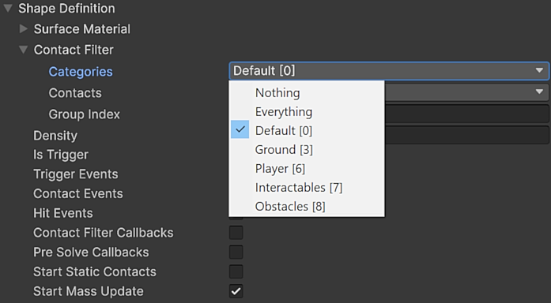
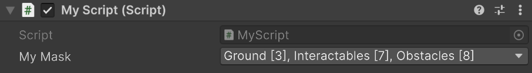
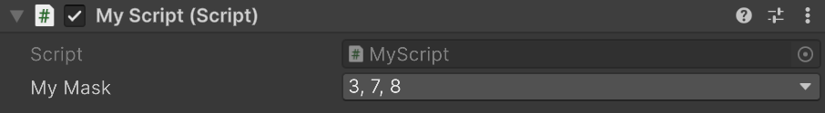

# Physics Layers

Unity’s built-in [Layer](https://docs.unity3d.com/6000.3/Documentation/ScriptReference/LayerMask.html) system uses a 32-bit integer (`int`) where each bit represents one layer (up to 32 total), making it efficient for tasks like collision filtering.
Each layer also has an associated name, simplifying use in both the Editor and at runtime.

However, 32 layers can become limiting because many systems and components rely on them.
And since `LayerMask` implicitly converts to `int`, it’s easy to confuse a single layer number (ordinal) with a `LayerMask`.

The low-level physics system has its own dedicated layer system which also supports 64 layers via [`PhysicsMask`](PhysicsMask.md), a 64-bit type; however, it can be configured to use the existing 32-bit layer system.
To enable this, the [`PhysicsLayers`](https://docs.unity3d.com/6000.3/Documentation/ScriptReference/LowLevelPhysics2D.PhysicsLayers.html) type lets you use 64-bit layers or operate in a backward-compatible mode that uses the existing 32-layer system.

This document will refer to the 32-bit layer system as the "global layer system" and the dedicated 64-bit layer system as the "physics layer system".

## Usage

The physics system use layers with the `PhysicsMask` type for:
- [PhysicsShape.ContactFilter](https://docs.unity3d.com/6000.3/Documentation/ScriptReference/LowLevelPhysics2D.PhysicsShape.ContactFilter.html): Controls which `PhysicsShape` pair can create contacts.
- [PhysicsQuery.QueryFilter](https://docs.unity3d.com/6000.3/Documentation/ScriptReference/LowLevelPhysics2D.PhysicsQuery.QueryFilter.html): Controls which `PhysicsShape` are returned from queries.

When configuring `PhysicsShape.ContactFilter` or `PhysicsQuery.QueryFilter`, you’ll use `PhysicsMask`, which is a raw bit mask with no built-in knowledge of layers.
To obtain a layer mask from the physics layer system, use `PhysicsLayers`, which provides:
- [GetLayerMask](https://docs.unity3d.com/6000.3/Documentation/ScriptReference/LowLevelPhysics2D.PhysicsLayers.GetLayerMask.html): Get a mask from one or more layer names.
- [GetLayerName](https://docs.unity3d.com/6000.3/Documentation/ScriptReference/LowLevelPhysics2D.PhysicsLayers.GetLayerName.html): Get a layer name from an ordinal (number).
- [GetLayerOrdinal](https://docs.unity3d.com/6000.3/Documentation/ScriptReference/LowLevelPhysics2D.PhysicsLayers.GetLayerOrdinal.html): Get an ordinal (number) from a layer name.

Using these, you can convert freely between layer names, layer numbers (ordinals), and `PhysicsMask` values.

The physics system allows you to switch between the global layer system and the physics layer system (see "Configuration" below).
When you use `PhysicsLayers`, it uses the currently selected layer system, so no code changes are required.
In the Editor, the Inspector also displays the correct layer names for whichever layer system is currently selected.

## Configuration

To configure whether the physics layer system is used and to set its layer names, assign and configure the low-level settings asset (see [PhysicsLowLevelSettings2D](PhysicsLowLevelSettings2D.md) for details).

- To select the layer system, toggle "Use Full Layers".
- To configure layer names, use "Physics Layer Names".

Note: “Full” means the physics layer system uses all 64 bits of a `PhysicsMask`; the global layer system uses only the lower 32 bits (upper 32 are zero).

With the "Use Full Layers" **enabled**, the Unity Editor Inspector will display layer names and layer numbers (ordinals) defined in the low-level settings, for example:

With the "Use Full Layers" **disabled**, the Unity Editor Inspector will only display layer names defined globally, for example:

Note: Switching between the global and physics layer systems is safe. Existing `PhysicsMask` values remain unchanged; only the names mapped to their bits (as shown in the Editor) change.

## Not using Layers

By default, a `PhysicsMask` field in a script is shown in the Unity Editor as a set of layers:

If your `PhysicsMask` represents an arbitrary 64-bit flag mask rather than layers, add the [`PhysicsMask.ShowAsPhysicsMask`](https://docs.unity3d.com/6000.3/Documentation/ScriptReference/LowLevelPhysics2D.PhysicsMask.ShowAsPhysicsMaskAttribute.html) attribute to the field.
The Editor will then display it as a raw 64-bit mask, showing only the selected bits:

