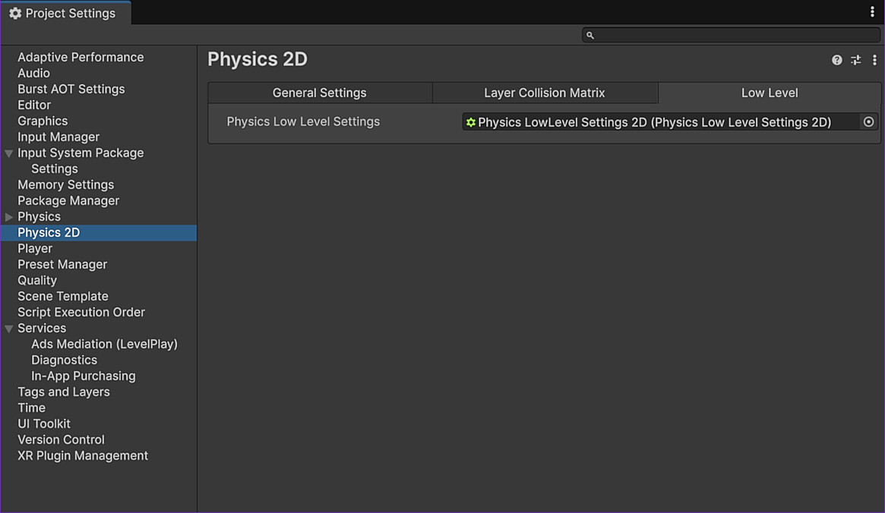

# Physics 2D LowLevel Primer

This document contains detailed information to help you understand what the low-level physics provides.

## Examples
This project contains individual examples which cover lots of features.
A good place to start is to look at the [README](./Assets/Examples/README.md) in the examples folder which describes each example for you to load-up and look at in more detail.

## Overview


### Namespace

The low-level physics API discussed below exists entirely in the `UnityEngine.LowLevelPhysics2D` namespace
A good jumping off point is the `PhysicsWorld` type found [here](https://docs.unity3d.com/6000.3/Documentation/ScriptReference/LowLevelPhysics2D.PhysicsWorld.html).

---
### Objects
The low-level physics in Unity (referred to as the "API") directly exposes a high-performance physics engine [Box2D v3](https://github.com/erincatto/box2d) in a way that is not tied to using GameObjects or Components.
For this reason, the objects do not exist in the Unity Editor Inspector, however they can be used in scripts and as Unity components so they can be exposed and therefore configured in the inspector.
All the API types are `structs` and many are serializable allowing them to be persisted and edited in components in the Editor inspector.

The API is designed to present a friendly, object-oriented way to create, configure and destroy objects however behind the scenes, everything is data-orientated, being stored in an efficient, memory-access friendly way which helps with performance. 
All objects that are created are actually exposed in C# as simple `read-only structs` that contain only a 64-bit opaque handle to the actual object that is stored inside the engine.
You should never explicitly need to care about this handle as it's implicitly used for you by the API however, it's important to understand that this handle-based approach has the benefit that objects can be passed around efficiently, even off the main-thread in C# Jobs because everything is a small `struct`.
Additionally, because everything is a `struct`, they can all be stored in native-containers which only support struct storage but can be used in C# Jobs.

In term of lifetime, if an object is destroyed, whether explicitly or in some cases implicitly, its handle simply becomes invalid and any subsequent access using that handle will result in a clear message being shown in the console indicating the issue.
As an aside, the same is applied to all arguments for all methods on such an object; if any are out-of-range or invalid for any reason, a clear message will be displayed in the console indicating the argument and call-site.

Finally, although not important to understand, it can be worth knowing how it's structured.
All object handles have at least an index and a generation integer. The index represents an index into a storage pool whereas the generation indicates the index position being reused when a previous object at that position was destroyed, the generation is simply incremented.
This applies to the `PhysicsWorld` handle.  All other objects that live inside a `PhysicsWorld` have an additional world-index integer indicating to which world they belong.
A handle is never larger than 64-bits which therefore means no `struct` representing a physics object is larger than this. 

---
### Multi-threading Support
Most of the API is thread-safe therefore you can freely perform read and write operations off the main-thread.
This is achieved by the use of WORM (Write-Once / Read-Many) lock system. This means you can perform unlimited read operations in parallel but only a single thread can perform a write operation.
The locking mechanism tries not to "starve" writers as when a write-operation is required, it blocks further reads, processes all current readers, performs the write-operation then processes readers again.
This locking has an extremely low overhead and provides the huge benefit of being able to use most of the API in C# Jobs.
Nevertheless, care must be taken when performing mixed read/write operations across many threads as performance can suffer if you're not careful.

The few methods that are no currently marked as thread-safe are only like this at the moment during the initial release.
These method are the Create, CreateBatch, Destroy and DestroyBatch methods for all objects.
The reason for this is not a technical limitation, they are inherently already thread-safe however we are being cautious due to the fact that there is a potential to cause deadlocks if not careful.
For that reason alone, we have decided to limit these methods, for now, to main-thread use only and are investigating a method to help avoid deadlock situations.
This should not be an issue as creating objects such as this off the main-thread isn't a common use-cases, especially considering that create and destroy operations are write-operations.

A final note is that locking is per-world so for instance, you can perform write operations on different worlds in parallel without any read/write contentions.

---
### GC
All the API is GC friendly meaning no C# heap allocations are made at any point.
Everything that is allocated by the API is done inside the native engine with objects being returned to C# as a `readonly struct` containing only  64-bit handle.
Additionally, the only other allocations are when using methods or properties that return a set of values or accepts a set of values as they use `NativeArray<T>` and `ReadOnlySpan<T>` respectively.

For instance, performing a query will return a `NativeArray<T>` of results which you must dispose of like so:
```csharp
void Run()
{
    ...
    // Perform a query.    
    var results = world.CastRay(<args>)
    
    ... do some work ...
        
    // Dispose of the results.
    results.Dispose();
}
```
Because it's very common that the results returned do not need to be modified but only read, C# provides a simpler and less error-prone way to ensure correct disposal, typically when using [Temp](https://docs.unity3d.com/6000.3/Documentation/ScriptReference/Unity.Collections.Allocator.Temp.html) or [TempJob](https://docs.unity3d.com/6000.3/Documentation/ScriptReference/Unity.Collections.Allocator.TempJob.html) allocators:
```csharp
void Run()
{
    ...
    // Perform a query and dispose when we go out of scope.    
    using var results = world.CastRay(<args>)
    
    ... do some work ...
}
```

The operations that return multiple results such as this (irrelevant of what is being returned) all offer the option to allocate using the [Temp](https://docs.unity3d.com/6000.3/Documentation/ScriptReference/Unity.Collections.Allocator.Temp.html), [TempJob](https://docs.unity3d.com/6000.3/Documentation/ScriptReference/Unity.Collections.Allocator.TempJob.html) or [Persistent](https://docs.unity3d.com/6000.3/Documentation/ScriptReference/Unity.Collections.Allocator.Persistent.html) allocator with the default being the [Temp](https://docs.unity3d.com/6000.3/Documentation/ScriptReference/Unity.Collections.Allocator.Temp.html) allocator like so:
```csharp
void Run()
{
    ...
    // Perform a query and allocate for persistent use over many frames.    
    var results = world.CastRay(<args>, Allocator.Persistent);
    
    ... do some work ...
}
```

When asking for events, those are not copied but are instead accessed <b>directly</b> from inside the engine itself so you can use `ReadOnlySpan<ContactBeginEvent> events = world.contactBeginEvents;` or `var events = world.contactBeginEvents;` as you prefer like so:
```csharp
void Run()
{
    ...
    // Iterate the current contact begin events.
    // NOTE: These do not require deallocation as they are direct memory access!
    foreach(var evt in world.contactBeginEvents)
        Debug.Log($"{evt.shapeA} hit {evt.shapeB}");
}
```
As noted in the documentation, when using values returned as `ReadOnlySpan<T>`, care should be taken as you are accessing memory directly from inside the engine.
Using spans provides a huge performance benefit however you should not perform any write operations as they can modify the memory that the span is accessing so will almost certainly result in a crash.
For instance, iterating on contact begin events and destroying a shape (write operation) while iterating can alter the events therefore you're likely to cause a crash.
A safer alternative to iterating raw events are callbacks which consume events and send them to the relevant objects if they are configured to receive them. 

---
## Definitions
When you create an object, it is far more efficient to create it with all its properties already set.
Creating an object and then changing multiple properties is slower than having it setup correctly initially, more so if the properties have side effects which case recalculations.
To this end, whenever you create an object you can (and should) specify what is known as a definition.
A definition contains all the available settings for that object with each object type having its own dedicated definition type.
For instance, a [PhysicsWorld](https://docs.unity3d.com/6000.3/Documentation/ScriptReference/LowLevelPhysics2D.PhysicsWorld.htm) has a [PhysicsWorldDefinition](https://docs.unity3d.com/6000.3/Documentation/ScriptReference/LowLevelPhysics2D.PhysicsWorldDefinition.html),
a [PhysicsBody](https://docs.unity3d.com/6000.3/Documentation/ScriptReference/LowLevelPhysics2D.PhysicsBody.html), has a [PhysicsBodyDefinition](https://docs.unity3d.com/6000.3/Documentation/ScriptReference/LowLevelPhysics2D.PhysicsBodyDefinition.html) etc.

All definitions also have a default which can always be accessed via a static `.defaultDefinition` property on the definition type itself i.e.
[PhysicsWorldDefinition.defaultDefinition](https://docs.unity3d.com/6000.3/Documentation/ScriptReference/LowLevelPhysics2D.PhysicsWorldDefinition-defaultDefinition.html),
[PhysicsBodyDefinition.defaultDefinition](https://docs.unity3d.com/6000.3/Documentation/ScriptReference/LowLevelPhysics2D.PhysicsBodyDefinition-defaultDefinition.html) etc.
A shortcut to this is simply using the C# `new` keyword with the default constructor like so:
```csharp
void Run()
{
    // Create a default body definition using the default constructor.
    var bodyDef1 = PhysicsBodyDefinition.defaultDefinition;
    
    // Create a default body definition using the default constructor.
    var bodyDef2 = new PhysicsBodyDefinition();
    
    // Create a default body definition using the default constructor and override specific properties.
    var bodyDef3 = new PhysicsBodyDefinition
    {
        linearVelocity = Vector2.right * 4f,
        gravityScale = 0f
    };
}
```
Creating an object with a definition can therefore be done like this:
```csharp
void Run()
{
    ...

    // These are all equivalent, all using the default body definition.
    var body1 = world.CreateBody(PhysicsBodyDefinition.default);
    var body2 = world.CreateBody(new PhysicsBodyDefinition());
    var body3 = world.CreateBody();
        
    // Create a default body definition using the default constructor and override specific properties.
    var bodyDef = new PhysicsBodyDefinition
    {
        linearVelocity = Vector2.right * 4f,
        gravityScale = 0f
    };
    
    // Create the body using our body definition.
    var body4 = world.CreateBody(bodyDef);
    
    // Modify our definition.
    // NOTE: This does not and cannot affect the previously created "body4".
    bodyDef.gravityScale = -9.81f
    
    // Create the body using our modified body definition.
    var body5 = world.CreateBody(bodyDef);
}
```
Like everything else in the API, definitions are `structs` so as shown above, they are used by-value meaning they can be reused, passed around etc.
All definitions are serializable which makes it very useful in exposing them as fields to be edited in the Editor inspector when creating components.
All `structs` involved in configuring configuring objects or specifying queries are also serializable for this reason.

Even more powerful is that even these defaults are <b>not</b> hardwired but can themselves be configured via a dedicated asset of [PhysicsLowLevelSettings2D](https://docs.unity3d.com/6000.3/Documentation/ScriptReference/LowLevelPhysics2D.PhysicsLowLevelSettings2D.html) (the only `class` type in the API).

This asset can be created via the Assets menu under `Create > 2D > Physics LowLevel Settings`:


You can then drag that asset into the "Low Level" tab (new!) in `Project Settings > Physics 2D`:



You can then select the asset and edit it directly in the Editor:


Modifications to the asset take immediate effect.
You are free to have multiple asset settings and swap them as you wish however you should be careful when changing defaults as the code you write will typically assume a certain set of defaults with you overriding specific properties.
For instance, the default [PhysicsBody.bodyType](https://docs.unity3d.com/6000.3/Documentation/ScriptReference/LowLevelPhysics2D.PhysicsBody-bodyType.html) is `Static`.

If this is changed, code that doesn't override this explicitly to `Static` will now work with a different body-type:


This asset provides all the available defaults for all definitions and other important global settings such as:
- The default `PhysicsWorld` ([PhysicsWorld.defaultWorld](https://docs.unity3d.com/6000.3/Documentation/ScriptReference/LowLevelPhysics2D.PhysicsWorld-defaultWorld.html)) created by Unity uses the default [PhysicsWorldDefinition](https://docs.unity3d.com/6000.3/Documentation/ScriptReference/LowLevelPhysics2D.PhysicsWorldDefinition.html) (you must restart the Editor or enter/exit Play mode for this to take effect) 
- The number of concurrent world simulations that are allowed
- The length units-per-meter (used when larger scales are required i.e. pixels as meters etc)
- If the debug renderer is available in player builds
- If the whole low-level physics system should be bypassed (no simulation and rendering allowed)
- If the full 64-bit layer system should be used in which case, all the property drawers will display names from the specified `PhysicsLayers`
- The `PhysicsLayer` names
- etc.

You can be seen in both the `Sandbox` and `Primer` projects.

---
## Important New Features

- Ability to work with 2D planes other than the standard XY plane such as the more common to 3D, [PhysicsWorld.TransformPlane.XZ](https://docs.unity3d.com/6000.3/Documentation/ScriptReference/LowLevelPhysics2D.PhysicsWorld.TransformPlane.XZ.html) plane.
  Each `PhysicsWorld` has support for working in a selected [TransformPlane](https://docs.unity3d.com/6000.3/Documentation/ScriptReference/LowLevelPhysics2D.PhysicsWorld.TransformPlane.html) with [PhysicsWorld.transformPlane](https://docs.unity3d.com/6000.3/Documentation/ScriptReference/LowLevelPhysics2D.PhysicsWorld-transformPlane.html).
  Whilst the physics system will render in the selected plane, it is still a 2D physics engine which only works with `Vector2` therefore it is 
  your responsibility to convert the `Vector2` to/from `Vector3` however there are many `PhysicsMath` utilities to help make this easy such as:
  - [PhysicsMath.ToPhysicsTransform](https://docs.unity3d.com/6000.3/Documentation/ScriptReference/LowLevelPhysics2D.PhysicsMath.ToPhysicsTransform.html)
  - [PhysicsMath.ToPosition3D](https://docs.unity3d.com/6000.3/Documentation/ScriptReference/LowLevelPhysics2D.PhysicsMath.ToPosition3D.html)
  - [PhysicsMath.ToPosition2D](https://docs.unity3d.com/6000.3/Documentation/ScriptReference/LowLevelPhysics2D.PhysicsMath.ToPosition2D.html)
  - [PhysicsMath.ToRotation2D](https://docs.unity3d.com/6000.3/Documentation/ScriptReference/LowLevelPhysics2D.PhysicsMath.ToRotation2D.html)
  - [PhysicsMath.ToRotationFast3D](https://docs.unity3d.com/6000.3/Documentation/ScriptReference/LowLevelPhysics2D.PhysicsMath.ToRotationFast3D.html)
  - [PhysicsMath.ToRotationSlow2D](https://docs.unity3d.com/6000.3/Documentation/ScriptReference/LowLevelPhysics2D.PhysicsMath.ToRotationSlow3D.html)
  - [PhysicsMath.GetRotationAxes](https://docs.unity3d.com/6000.3/Documentation/ScriptReference/LowLevelPhysics2D.PhysicsMath.GetRotationAxes.html)
  - [PhysicsMath.GetTranslationAxes](https://docs.unity3d.com/6000.3/Documentation/ScriptReference/LowLevelPhysics2D.PhysicsMath.GetTranslationAxes.html)
  - Others!
- Ability to control if and how the `PhysicsWorld` writes `PhysicsBody` position and rotation (pose) to a Unity [Transform](https://docs.unity3d.com/6000.3/Documentation/ScriptReference/Transform.html)
    - Controlled via [PhysicsWorld.transformWriteMode](https://docs.unity3d.com/6000.3/Documentation/ScriptReference/LowLevelPhysics2D.PhysicsWorld-transformWriteMode.html)
        - [TransformWriteMode.Off](https://docs.unity3d.com/6000.3/Documentation/ScriptReference/LowLevelPhysics2D.PhysicsWorld.TransformWriteMode.Off.html) - Transforms are never written
        - [TransformWriteMode.Fast2D](https://docs.unity3d.com/6000.3/Documentation/ScriptReference/LowLevelPhysics2D.PhysicsWorld.TransformWriteMode.Fast2D.html) - Transforms are written fast (rotation writes to the rotation axis defined by the [TransformPlane](https://docs.unity3d.com/6000.3/Documentation/ScriptReference/LowLevelPhysics2D.PhysicsWorld.TransformPlane.html), other axis are resets)
        - [TransformWriteMode.Slow3D](https://docs.unity3d.com/6000.3/Documentation/ScriptReference/LowLevelPhysics2D.PhysicsWorld.TransformWriteMode.Slow3D.html) - Transforms are written slower (rotation writes to the rotation axis defined by the [TransformPlane](https://docs.unity3d.com/6000.3/Documentation/ScriptReference/LowLevelPhysics2D.PhysicsWorld.TransformPlane.html), other axis are unaffected)
    - Each `PhysicsBody` will only write if the [PhysicsBody.transformObject](https://docs.unity3d.com/6000.3/Documentation/ScriptReference/LowLevelPhysics2D.PhysicsBody-transformObject.html) is set to a Unity [Transform](https://docs.unity3d.com/6000.3/Documentation/ScriptReference/Transform.html)
    - Each `PhysicsBody` controls if and how it wants to write to the transform using [PhysicsBody.transformWriteMode](https://docs.unity3d.com/6000.3/Documentation/ScriptReference/LowLevelPhysics2D.PhysicsBody-transformWriteMode.html)
      - [PhysicsBodyTransformWriteMode.Off](https://docs.unity3d.com/6000.3/Documentation/ScriptReference/LowLevelPhysics2D.PhysicsBody.TransformWriteMode.Off.html) - The body pose is never written
      - [PhysicsBodyTransformWriteMode.Current](https://docs.unity3d.com/6000.3/Documentation/ScriptReference/LowLevelPhysics2D.PhysicsBody.TransformWriteMode.Current.html) - The current body pose is written after the simulation step
      - [PhysicsBodyTransformWriteMode.Interpolate](https://docs.unity3d.com/6000.3/Documentation/ScriptReference/LowLevelPhysics2D.PhysicsBody.TransformWriteMode.Interpolate.html) - The body pose moving from the previous body pose to the current body pose is written per-frame (historic)
      - [PhysicsBodyTransformWriteMode.Extrapolate](https://docs.unity3d.com/6000.3/Documentation/ScriptReference/LowLevelPhysics2D.PhysicsBody.TransformWriteMode.Extrapolate.html) - A pose extrapolated from the current body pose and the current linear and angular velocities (predictive) 
- Ability to control how many additional worker threads are used (from 0 to 63) to solve the simulation of each world via [PhysicsWorld.simulationWorkers](https://docs.unity3d.com/6000.3/Documentation/ScriptReference/LowLevelPhysics2D.PhysicsWorld-simulationWorkers.html).
  This value is always clamped to the available threads on the device at runtime. Certain platforms are single-threaded such as WebGL. Main-thread performance has still be increased by at least x3-x4 however. 
- Ability to simulate multiple worlds in parallel controlled via [PhysicsWorld.concurrentSimulations](https://docs.unity3d.com/6000.3/Documentation/ScriptReference/LowLevelPhysics2D.PhysicsWorld-concurrentSimulations.html)
- Ability to use more than the standard 32 layers when controlling contacts and performing queries, now increased to 64 layers via [PhysicsMask](https://docs.unity3d.com/6000.3/Documentation/ScriptReference/LowLevelPhysics2D.PhysicsMask.html), [PhysicsLayers](https://docs.unity3d.com/6000.3/Documentation/ScriptReference/LowLevelPhysics2D.PhysicsLayers.html) and [PhysicsWorld.useFullLayers](https://docs.unity3d.com/6000.3/Documentation/ScriptReference/LowLevelPhysics2D.PhysicsWorld-useFullLayers.html).
- Ability to pause a world simulation via [PhysicsWorld.paused](https://docs.unity3d.com/6000.3/Documentation/ScriptReference/LowLevelPhysics2D.PhysicsWorld-paused.html)
- Dedicated types for physics operations:
  - [PhysicsTransform](https://docs.unity3d.com/6000.3/Documentation/ScriptReference/LowLevelPhysics2D.PhysicsTransform.html) - Handles three degrees of freedom (position and rotation)
  - [PhysicsRotate](https://docs.unity3d.com/6000.3/Documentation/ScriptReference/LowLevelPhysics2D.PhysicsRotate.html) - Handles single axis rotation (a subcomponent of `PhysicsTransform`)
  - [PhysicsLayers](https://docs.unity3d.com/6000.3/Documentation/ScriptReference/LowLevelPhysics2D.PhysicsLayers.html) - Handles 64 named layers using `PhysicsMask`. This is a 64-bit equivalent of `LayerMask`. 
  - [PhysicsMask](https://docs.unity3d.com/6000.3/Documentation/ScriptReference/LowLevelPhysics2D.PhysicsMask.html) - Handles 64-bit masking for layers, contact control, queries etc. (a new UIElement type of [Mask64Field](https://docs.unity3d.com/6000.3/Documentation/ScriptReference/UIElements.Mask64Field.html) was created for this).
  - [PhysicsPlane](https://docs.unity3d.com/6000.3/Documentation/ScriptReference/LowLevelPhysics2D.PhysicsPlane.html) - Handles a 2D plane (limited use for now but future use with `PhysicsWorld.CastMover`)
  - [PhysicsAABB](https://docs.unity3d.com/6000.3/Documentation/ScriptReference/LowLevelPhysics2D.PhysicsAABB.html) - Handles 2D bounds
- Event system (read as `ReadOnlySpan<T>`):
  - [PhysicsEvents.PreSimulate](https://docs.unity3d.com/6000.3/Documentation/ScriptReference/LowLevelPhysics2D.PhysicsEvents.PreSimulate.html) - Callback per-world called prior to any simulation step
  - [PhysicsEvents.PostSimulate](https://docs.unity3d.com/6000.3/Documentation/ScriptReference/LowLevelPhysics2D.PhysicsEvents.PostSimulate.html) - Callback per-world called after any simulation step
  - [PhysicsWorld.bodyUpdateEvents](https://docs.unity3d.com/6000.3/Documentation/ScriptReference/LowLevelPhysics2D.PhysicsWorld-bodyUpdateEvents.html) - Event produced when a `PhysicsBody` is updated by the simulation
  - [PhysicsWorld.contactBeginEvents](https://docs.unity3d.com/6000.3/Documentation/ScriptReference/LowLevelPhysics2D.PhysicsWorld-contactBeginEvents.html) - Event produced when a pair of `PhysicsShape` come into contact
  - [PhysicsWorld.contactEndEvents](https://docs.unity3d.com/6000.3/Documentation/ScriptReference/LowLevelPhysics2D.PhysicsWorld-contactEndEvents.html) - Event produced when a pair of `PhysicsShape` stop contacting
  - [PhysicsWorld.contactHitEvents](https://docs.unity3d.com/6000.3/Documentation/ScriptReference/LowLevelPhysics2D.PhysicsWorld-contactHitEvents.html) - Event produced when a pair of `PhysicsShape` come into contact beyond a specified speed threshold
  - [PhysicsWorld.triggerBeginEvents](https://docs.unity3d.com/6000.3/Documentation/ScriptReference/LowLevelPhysics2D.PhysicsWorld-triggerBeginEvents.html) - Event produced when a pair of `PhysicsShape` (if either is configured as a [trigger](https://docs.unity3d.com/6000.3/Documentation/ScriptReference/LowLevelPhysics2D.PhysicsShape-isTrigger.html)) start overlapping
  - [PhysicsWorld.triggerEndEvents](https://docs.unity3d.com/6000.3/Documentation/ScriptReference/LowLevelPhysics2D.PhysicsWorld-triggerEndEvents.html) - Event produced when a pair of `PhysicsShape` (if either is configured as a [trigger](https://docs.unity3d.com/6000.3/Documentation/ScriptReference/LowLevelPhysics2D.PhysicsShape-isTrigger.html)) stop overlapping
  - [PhysicsWorld.jointThresholdEvents](https://docs.unity3d.com/6000.3/Documentation/ScriptReference/LowLevelPhysics2D.PhysicsWorld-jointThresholdEvents.html) - Event produced when a `PhysicsJoint` exceeds its [force](https://docs.unity3d.com/6000.3/Documentation/ScriptReference/LowLevelPhysics2D.PhysicsJoint-forceThreshold.html) or [torque](https://docs.unity3d.com/6000.3/Documentation/ScriptReference/LowLevelPhysics2D.PhysicsJoint-torqueThreshold.html) threshold
- Callback system producing callbacks to specified [MonoBehaviour](https://docs.unity3d.com/6000.3/Documentation/ScriptReference/MonoBehaviour.html) relevant objects:
  - Callback targets set via [xxx.callbackTarget](https://docs.unity3d.com/6000.3/Documentation/ScriptReference/30_search.html?q=callbacktarget) and called if object implements:
    - [PhysicsCallbacks.IContactFilterCallback](https://docs.unity3d.com/6000.3/Documentation/ScriptReference/LowLevelPhysics2D.PhysicsCallbacks.IContactFilterCallback.html) - Allows controlling if a contact will be allowed or not prior to being sent to the solver
    - [PhysicsCallbacks.IPreSolveCallback](https://docs.unity3d.com/6000.3/Documentation/ScriptReference/LowLevelPhysics2D.PhysicsCallbacks.IPreSolveCallback.html) - Allows controlling if a contact is enabled or disabled prior to solving
    - [PhysicsCallbacks.IBodyUpdateCallback](https://docs.unity3d.com/6000.3/Documentation/ScriptReference/LowLevelPhysics2D.PhysicsCallbacks.IBodyUpdateCallback.html) - Provides notification that a `PhysicsBody` was updated in position/rotation or fell asleep during the simulation step
    - [PhysicsCallbacks.IContactCallback](https://docs.unity3d.com/6000.3/Documentation/ScriptReference/LowLevelPhysics2D.PhysicsCallbacks.IContactCallback.html) - Provides notification of both contact begin and contact end ends for a pair of `PhysicsShape`
    - [PhysicsCallbacks.ITriggerCallback](https://docs.unity3d.com/6000.3/Documentation/ScriptReference/LowLevelPhysics2D.PhysicsCallbacks.ITriggerCallback.html) - Provides notification of both trigger begin and trigger end ends for a pair of `PhysicsShape` (if either is configured as a [trigger](https://docs.unity3d.com/6000.3/Documentation/ScriptReference/LowLevelPhysics2D.PhysicsShape-isTrigger.html))
    - [PhysicsCallbacks.IJointThresholdCallback](https://docs.unity3d.com/6000.3/Documentation/ScriptReference/LowLevelPhysics2D.PhysicsCallbacks.IJointThresholdCallback.html) - Provides notification when a `PhysicsJoint` exceeds its [force](https://docs.unity3d.com/6000.3/Documentation/ScriptReference/LowLevelPhysics2D.PhysicsJoint-forceThreshold.html) or [torque](https://docs.unity3d.com/6000.3/Documentation/ScriptReference/LowLevelPhysics2D.PhysicsJoint-torqueThreshold.html) thresholds
  - Event-related callbacks are automatically sent from a world only if enabled via:
    - [PhysicsWorld.autoBodyUpdateCallbacks](https://docs.unity3d.com/6000.3/Documentation/ScriptReference/LowLevelPhysics2D.PhysicsWorld-autoBodyUpdateCallbacks.html)
    - [PhysicsWorld.autoContactCallbacks](https://docs.unity3d.com/6000.3/Documentation/ScriptReference/LowLevelPhysics2D.PhysicsWorld-autoContactCallbacks.html)
    - [PhysicsWorld.autoTriggerCallbacks](https://docs.unity3d.com/6000.3/Documentation/ScriptReference/LowLevelPhysics2D.PhysicsWorld-autoTriggerCallbacks.html)
    - [PhysicsWorld.autoJointThresholdCallbacks](https://docs.unity3d.com/6000.3/Documentation/ScriptReference/LowLevelPhysics2D.PhysicsWorld-autoJointThresholdCallbacks.html)
  - Event-related callbacks can be manually sent from a world at any time via:
    - [PhysicsWorld.sendAllCallbacks()](https://docs.unity3d.com/6000.3/Documentation/ScriptReference/LowLevelPhysics2D.PhysicsWorld-sendAllCallbacks.html)
    - [PhysicsWorld.sendBodyUpdateCallbacks()](https://docs.unity3d.com/6000.3/Documentation/ScriptReference/LowLevelPhysics2D.PhysicsWorld-sendBodyUpdateCallbacks.html)
    - [PhysicsWorld.sendContactCallbacks()](https://docs.unity3d.com/6000.3/Documentation/ScriptReference/LowLevelPhysics2D.PhysicsWorld-sendContactCallbacks.html)
    - [PhysicsWorld.sendTriggerCallbacks()](https://docs.unity3d.com/6000.3/Documentation/ScriptReference/LowLevelPhysics2D.PhysicsWorld-sendTriggerCallbacks.html)
    - [PhysicsWorld.sendJointThresholdCallbacks()](https://docs.unity3d.com/6000.3/Documentation/ScriptReference/LowLevelPhysics2D.PhysicsWorld-sendJointThresholdCallbacks.html)
- Dedicated math utilities: [PhysicsMath](https://docs.unity3d.com/6000.3/Documentation/ScriptReference/LowLevelPhysics2D.PhysicsMath.html).
- Speculative contact system via [PhysicsWorld.speculativeContactDistance](https://docs.unity3d.com/6000.3/Documentation/ScriptReference/LowLevelPhysics2D.PhysicsWorld-speculativeContactDistance.html).
- Definition-based configuration for all objects including the `PhysicsWorld` meaning each world can be configured independently.
- Support for per-object custom data to aid in scripting logic for identification, debugging (etc.) via [PhysicsUserData](https://docs.unity3d.com/6000.3/Documentation/ScriptReference/LowLevelPhysics2D.PhysicsUserData.html).
  - [PhysicsWorld.userData](https://docs.unity3d.com/6000.3/Documentation/ScriptReference/LowLevelPhysics2D.PhysicsWorld-userData.html)
  - [PhysicsBody.userData](https://docs.unity3d.com/6000.3/Documentation/ScriptReference/LowLevelPhysics2D.PhysicsBody-userData.html)
  - [PhysicsShape.userData](https://docs.unity3d.com/6000.3/Documentation/ScriptReference/LowLevelPhysics2D.PhysicsShape-userData.html)
  - [PhysicsChain.userData](https://docs.unity3d.com/6000.3/Documentation/ScriptReference/LowLevelPhysics2D.PhysicsChain-userData.html)
  - [PhysicsJoint.userData](https://docs.unity3d.com/6000.3/Documentation/ScriptReference/LowLevelPhysics2D.PhysicsJoint-userData.html)
- Dedicated Geometry types used for creating `PhysicsShape`, queries and debug drawing:
  - Types:
    - [CircleGeometry](https://docs.unity3d.com/6000.3/Documentation/ScriptReference/LowLevelPhysics2D.CircleGeometry.html)
    - [CapsuleGeometry](https://docs.unity3d.com/6000.3/Documentation/ScriptReference/LowLevelPhysics2D.CapsuleGeometry.html)
    - [PolygonGeometry](https://docs.unity3d.com/6000.3/Documentation/ScriptReference/LowLevelPhysics2D.PolygonGeometry.html)
    - [SegmentGeometry](https://docs.unity3d.com/6000.3/Documentation/ScriptReference/LowLevelPhysics2D.SegmentGeometry.html)
    - [ChainSegmentGeometry](https://docs.unity3d.com/6000.3/Documentation/ScriptReference/LowLevelPhysics2D.ChainSegmentGeometry.html)
    - [ChainGeometry](https://docs.unity3d.com/6000.3/Documentation/ScriptReference/LowLevelPhysics2D.ChainGeometry.html)
  - Consistent geometry queries and operations for all geometry types, examples below for `CapsuleGeometry` but applies to all geometries:
    - [CapsuleGeometry.CalculateAABB](https://docs.unity3d.com/6000.3/Documentation/ScriptReference/LowLevelPhysics2D.CapsuleGeometry.CalculateAABB.html)
    - [CapsuleGeometry.CalculateMassConfiguration](https://docs.unity3d.com/6000.3/Documentation/ScriptReference/LowLevelPhysics2D.CapsuleGeometry.CalculateMassConfiguration.html)
    - [CapsuleGeometry.CastRay](https://docs.unity3d.com/6000.3/Documentation/ScriptReference/LowLevelPhysics2D.CapsuleGeometry.CastRay.html)
    - [CapsuleGeometry.CastShape](https://docs.unity3d.com/6000.3/Documentation/ScriptReference/LowLevelPhysics2D.CapsuleGeometry.CastShape.html)
    - [CapsuleGeometry.ClosestPoint](https://docs.unity3d.com/6000.3/Documentation/ScriptReference/LowLevelPhysics2D.CapsuleGeometry.ClosestPoint.html)
    - [CapsuleGeometry.OverlapPoint](https://docs.unity3d.com/6000.3/Documentation/ScriptReference/LowLevelPhysics2D.CapsuleGeometry.OverlapPoint.html)
    - [CapsuleGeometry.Intersect](https://docs.unity3d.com/6000.3/Documentation/ScriptReference/LowLevelPhysics2D.CapsuleGeometry.Intersect.html)
    - [CapsuleGeometry.Transform](https://docs.unity3d.com/6000.3/Documentation/ScriptReference/LowLevelPhysics2D.CapsuleGeometry.Transform.html)
    - [CapsuleGeometry.InverseTransform](https://docs.unity3d.com/6000.3/Documentation/ScriptReference/LowLevelPhysics2D.CapsuleGeometry.InverseTransform.html)
- Dedicated Geometry Utilities (works in C# Jobs too):
  - Ability to <b>compose geometry</b> in layers using geometry [operations](https://docs.unity3d.com/6000.3/Documentation/ScriptReference/LowLevelPhysics2D.PhysicsComposer.Operation.html) via [PhysicsComposer](https://docs.unity3d.com/6000.3/Documentation/ScriptReference/LowLevelPhysics2D.PhysicsComposer.html)
    - Can compose `PolygonGeometry` via [PhysicsComposer.CreatePolygonGeometry](https://docs.unity3d.com/6000.3/Documentation/ScriptReference/LowLevelPhysics2D.PhysicsComposer.CreatePolygonGeometry.html)
    - Can compose `ChainGeometry` via `[PhysicsComposer.CreateChainGeometry](https://docs.unity3d.com/6000.3/Documentation/ScriptReference/LowLevelPhysics2D.PhysicsComposer.CreateChainGeometry.html)
  - Ability to <b>destruct `PolygonGeometry`</b> in two ways:
    - <b>Fragment</b> geometry using specified fracture points with masking support (for carving) via [PhysicsDestructor.Fragment](https://docs.unity3d.com/6000.3/Documentation/ScriptReference/LowLevelPhysics2D.PhysicsDestructor.Fragment.html)
    - <b>Slice</b> geometry in two along a ray via [PhysicsDestructor.Slice](https://docs.unity3d.com/6000.3/Documentation/ScriptReference/LowLevelPhysics2D.PhysicsDestructor.Slice.html)
- Much more!

---
## Primary Physics Types
### PhysicsWorld

A [PhysicsWorld](https://docs.unity3d.com/6000.3/Documentation/ScriptReference/LowLevelPhysics2D.PhysicsWorld.htm) also known simply as a "world" is an isolated container for all other objects.
Multiple worlds can be created and simulated concurrently with the maximum number of worlds allowed being specified by [PhysicsConstants.MaxWorlds](https://docs.unity3d.com/6000.3/Documentation/ScriptReference/LowLevelPhysics2D.PhysicsConstants.MaxWorlds.html).
The `PhysicsWorld` is the only object that has a fixed limit, all other objects created in a world can be created without limit.

Any objects in one world cannot (in any way) be affected by objects in another world and thus are completely isolated in behaviour and in memory.
This is why multiple worlds can be simulated concurrently.
All objects created encode the world they exist in inside their handle so it is not possible to accidentally work with an object outside a world it exists. The context is permanent and safe.

All worlds can control when and how they simulate via [PhysicsWorld.simulationMode](https://docs.unity3d.com/6000.3/Documentation/ScriptReference/LowLevelPhysics2D.PhysicsWorld-simulationMode.html) or
[PhysicsWorldDefinition.simulationMode](https://docs.unity3d.com/6000.3/Documentation/ScriptReference/LowLevelPhysics2D.PhysicsWorldDefinition-simulationMode.html).
When the simulation mode is either [SimulationMode.FixedUpdate](https://docs.unity3d.com/6000.3/Documentation/ScriptReference/SimulationMode2D.FixedUpdate.html) or
[SimulationMode.Update](https://docs.unity3d.com/6000.3/Documentation/ScriptReference/SimulationMode2D.Update.html), the world will automatically be simulated at those times.

 Each world also has many other properties to control a wide range of behaviour options for the objects contained within it.

Whilst you can create a new `PhysicsWorld`, <b>it is far more common to use a single world, therefore a single world is automatically created for you</b> and is known as the "default world" and can always be accessed via [PhysicsWorld.defaultWorld](https://docs.unity3d.com/6000.3/Documentation/ScriptReference/LowLevelPhysics2D.PhysicsWorld-defaultWorld.html).

It is common to see code that uses `var world = PhysicsWorld.defaultWorld;` and then proceeds to use the `world` variable to access the world, create/destroy objects etc.

---
### PhysicsBody
A [PhysicsBody](https://docs.unity3d.com/6000.3/Documentation/ScriptReference/LowLevelPhysics2D.PhysicsBody.html) also known simply as a "body" exists within a specific world.
The role of a body is to maintain a position and rotation within a world and allow both shapes and joints (constraints) to be connected to them.

A body can be created like so:
```csharp
void Create()
{
    // Fetch the default world.
    var world = PhysicsWorld.defaultWorld;

    // Create a body.
    var body = world.CreateBody(); 
}
```

A body is the only object in a world that can move as it is the only object that knows about position and rotation and as such it contains many properties that control movement with
properties such as [PhysicsBody.linearVelocity](https://docs.unity3d.com/6000.3/Documentation/ScriptReference/LowLevelPhysics2D.PhysicsBody-linearVelocity.html) or
[PhysicsBody.angularVelocity](https://docs.unity3d.com/6000.3/Documentation/ScriptReference/LowLevelPhysics2D.PhysicsBody-angularVelocity.html) etc.

---
### PhysicsShape
A [PhysicsShape](https://docs.unity3d.com/6000.3/Documentation/ScriptReference/LowLevelPhysics2D.PhysicsShape.html) represents a primitive shape type attached to a `PhysicsBody`.
The role of a shape is to specify both a region relative to the `PhysicsBody` it is attached to and dynamic behaviour for when that region touches or overlaps another `PhysicsShape` on another `PhysicsBody`.
There are a fixed set of shape types as indicated by [PhysicsShape.shapeType](https://docs.unity3d.com/6000.3/Documentation/ScriptReference/LowLevelPhysics2D.PhysicsShape-shapeType.html) shown [here](https://docs.unity3d.com/6000.3/Documentation/ScriptReference/LowLevelPhysics2D.PhysicsShape.ShapeType.html).

When creating a `PhysicsShape`, along with a [PhysicsShapeDefinition](https://docs.unity3d.com/6000.3/Documentation/ScriptReference/LowLevelPhysics2D.PhysicsShapeDefinition.html) you specify the shape geometry.
Each shape type has its own geometry type i.e. [PhysicsShape.ShapeType.Circle](https://docs.unity3d.com/6000.3/Documentation/ScriptReference/LowLevelPhysics2D.PhysicsShape.ShapeType.Circle.html) uses [CircleGeometry](https://docs.unity3d.com/6000.3/Documentation/ScriptReference/LowLevelPhysics2D.CircleGeometry.html),
[PhysicsShape.ShapeType.Capsule](https://docs.unity3d.com/6000.3/Documentation/ScriptReference/LowLevelPhysics2D.PhysicsShape.ShapeType.Capsule.html) uses [CapsuleGeometry](https://docs.unity3d.com/6000.3/Documentation/ScriptReference/LowLevelPhysics2D.CapsuleGeometry.html) etc.

```csharp
void Create()
{
    // Fetch the default world.
    var world = PhysicsWorld.defaultWorld;

    // Create a body.
    var body = world.CreateBody();
    
    // Create a shape.
    var shape = body.CreateShape(CircleGeometry.defaultGeometry)
}
```

---
### PhysicsJoint
A [PhysicsJoint](https://docs.unity3d.com/6000.3/Documentation/ScriptReference/LowLevelPhysics2D.PhysicsJoint.html) represents a dynamic constraint between two `PhysicsBody`.
The role of a joint is one of a constraint behaviour ranging from maintaining a distance, restricting motions along an axis and/or rotation to ignoring contacts between two bodies.
They are typically used to model real-world dynamic behaviours, especially for physics-based mechanisms.
There are a fixed set of joint types as indicated by [PhysicsJoint.jointType](https://docs.unity3d.com/6000.3/Documentation/ScriptReference/LowLevelPhysics2D.PhysicsJoint-jointType.html) shown [here](https://docs.unity3d.com/6000.3/Documentation/ScriptReference/LowLevelPhysics2D.PhysicsJoint.JointType.html).

A joint is created in a world with code such as `var joint = world.CreateJoint(definition);` or the concrete call (depending on the joint type) of `var joint = PhysicsDistanceJoint.Create(world, definition);`.

---
## Queries
Many spatial queries are provided to allow interrogating the world and its contents, specifically the `PhysicsShape` that exist attached to `PhysicsBody`.
All queries are provided as methods of the `PhysicsWorld` type and are used on any instance of a `PhysicsWorld`.

### Overlap Queries
An overlap takes geometry and queries if it overlaps any `PhysicsShape` in the world, returning what it overlapped.
Each overlap query has an alterative which performs the same action however it only returns true/false (bool) if the overlap found anything, these are all prefixed with "Test".

- [PhysicsWorld.OverlapAABB](https://docs.unity3d.com/6000.3/Documentation/ScriptReference/LowLevelPhysics2D.PhysicsWorld.OverlapAABB.html)
- [PhysicsWorld.OverlapPoint](https://docs.unity3d.com/6000.3/Documentation/ScriptReference/LowLevelPhysics2D.PhysicsWorld.OverlapPoint.html)
- [PhysicsWorld.OverlapGeometry](https://docs.unity3d.com/6000.3/Documentation/ScriptReference/LowLevelPhysics2D.PhysicsWorld.OverlapGeometry.html)
- [PhysicsWorld.OverlapShape](https://docs.unity3d.com/6000.3/Documentation/ScriptReference/LowLevelPhysics2D.PhysicsWorld.OverlapShape.html)
- [PhysicsWorld.OverlapShapeProxy](https://docs.unity3d.com/6000.3/Documentation/ScriptReference/LowLevelPhysics2D.PhysicsWorld.OverlapShapeProxy.html)
- [PhysicsWorld.TestOverlapAABB](https://docs.unity3d.com/6000.3/Documentation/ScriptReference/LowLevelPhysics2D.PhysicsWorld.TestOverlapAABB.html)
- [PhysicsWorld.TestOverlapPoint](https://docs.unity3d.com/6000.3/Documentation/ScriptReference/LowLevelPhysics2D.PhysicsWorld.TestOverlapPoint.html)
- [PhysicsWorld.TestOverlapGeometry](https://docs.unity3d.com/6000.3/Documentation/ScriptReference/LowLevelPhysics2D.PhysicsWorld.TestOverlapGeometry.html)
- [PhysicsWorld.TestOverlapShape](https://docs.unity3d.com/6000.3/Documentation/ScriptReference/LowLevelPhysics2D.PhysicsWorld.TestOverlapShape.html)
- [PhysicsWorld.TestOverlapShapeProxy](https://docs.unity3d.com/6000.3/Documentation/ScriptReference/LowLevelPhysics2D.PhysicsWorld.TestOverlapShapeProxy.html)

### Cast Queries
A cast takes geometry, sweeps it through the world and queries if it contacts any `PhysicsShape`, returning what it contacted.

- [PhysicsWorld.CastRay](https://docs.unity3d.com/6000.3/Documentation/ScriptReference/LowLevelPhysics2D.PhysicsWorld.CastRay.html)
- [PhysicsWorld.CastGeometry](https://docs.unity3d.com/6000.3/Documentation/ScriptReference/LowLevelPhysics2D.PhysicsWorld.CastGeometry.html)
- [PhysicsWorld.CastShape](https://docs.unity3d.com/6000.3/Documentation/ScriptReference/LowLevelPhysics2D.PhysicsWorld.CastShape.html)
- [PhysicsWorld.CastShapeProxy](https://docs.unity3d.com/6000.3/Documentation/ScriptReference/LowLevelPhysics2D.PhysicsWorld.CastShapeProxy.html)
- [PhysicsWorld.CastMover](https://docs.unity3d.com/6000.3/Documentation/ScriptReference/LowLevelPhysics2D.PhysicsWorld.CastMover.html)

---
## Events and Callbacks
As seen above, the `PhysicsWorld` produces various events which can be quickly read using a `ReadOnlySpan<(event-type)>`.
For an event to be produced for a `PhysicsShap', it must first enable that type of event with:

- [PhysicsShape.contactEvents](https://docs.unity3d.com/6000.3/Documentation/ScriptReference/LowLevelPhysics2D.PhysicsShape-contactEvents.html)
- [PhysicsShape.triggerEvents](https://docs.unity3d.com/6000.3/Documentation/ScriptReference/LowLevelPhysics2D.PhysicsShape-triggerEvents.html)

When these are enabled, the respective events are produced and can be read after a simulation step from the `PhysicsWorld` the shapes are in with:

- [PhysicsWorld.contactBeginEvents](https://docs.unity3d.com/6000.3/Documentation/ScriptReference/LowLevelPhysics2D.PhysicsWorld-contactBeginEvents.html)
- [PhysicsWorld.contactEndEvents](https://docs.unity3d.com/6000.3/Documentation/ScriptReference/LowLevelPhysics2D.PhysicsWorld-contactEndEvents.html)
- [PhysicsWorld.triggerBeginEvents](https://docs.unity3d.com/6000.3/Documentation/ScriptReference/LowLevelPhysics2D.PhysicsWorld-triggerBeginEvents.html)
- [PhysicsWorld.triggerEndEvents](https://docs.unity3d.com/6000.3/Documentation/ScriptReference/LowLevelPhysics2D.PhysicsWorld-triggerEndEvents.html)

Reading events can be really useful however they are not collated or sorted in any way.
A far more powerful way to receive these kinds of events is when they are send directly to the `PhysicsShape` involved in the event.
This is what event callbacks are for.

All events have a corresponding callback however there are also callbacks unrelated to events such as [PhysicsCallbacks.IContactFilterCallback](https://docs.unity3d.com/6000.3/Documentation/ScriptReference/LowLevelPhysics2D.PhysicsCallbacks.IContactFilterCallback.html) and [PhysicsCallbacks.IPreSolveCallback](https://docs.unity3d.com/6000.3/Documentation/ScriptReference/LowLevelPhysics2D.PhysicsCallbacks.IPreSolveCallback.html).
The most common types of callbacks used are both the contact and trigger callbacks shown above which relate to `PhysicsShape` only.
Callbacks can be sent explicitly by calling the appropriate `PhysisWorld.sendXXXCallback` method (as shown in "New Features" above) or automatically by enabling the appropriate `PhysicsWorld.autoSendXXXCallback` option (also shown in "New Features" above). 

With callbacks being sent explicitly or automatically, relevant events are gathered and dispatched to objects which are related to that event.
Before an object can receive callbacks, it must specify the "callback target" which is the script that will receive the callbacks, known as the "callback Target".

To do this, you use [PhysicsShape.callbackTarget](https://docs.unity3d.com/6000.3/Documentation/ScriptReference/LowLevelPhysics2D.PhysicsShape-callbackTarget.html)

Currently, `PhysicsBody`, `PhysicsShape` and `PhysicsJoint` can receive event callbacks.

As a concrete example, let's see the most common use-case which is receiving a callback for a contact begin and contact end for a pair of `PhysicsShape`:
```csharp
// The test class that implements IContactCallback.
class MyTest : MonoBehaviour, PhysicsCallbacks.IContactCallback
{
    PhysicsBody m_PhysicsBody;
    PhysicsShape m_PhysicsShape;
    
    void OnEnable()
    {
        // Fetch the default world.
        var world = PhysicsWorld.defaultWorld;
        
        // Create a body/shape.
        m_PhysicsBody = world.CreateBody();
        m_PhysicsShape = m_PhysicsBody.CreateShape(CircleGeometry.defaultGeometry);
        
        // Enable contact events on the shape.
        // Without this, no events will be produced for this shape therefore no event callbacks.
        // With that said, this is only half true as if the shape this shape contacts does have contact-events enabled, then it will generate a callback.
        // However, without a callback target set on this shape, it won't receive a callback (see below).
        m_PhysicsShape.contactEvents = true;
        
        // Assign the script as a callback target for the shape.
        // This is all that is required to designate this script as a target for shape events for this specific shape.
        // If the callback target implements an appropriate interface for the callback event, it'll be called or not if it doesn't.
        // In our case, we implement IContactCallback so both ContactBeginEvent and ContactEndEvent will be called.
        // A PhysicsShape can also receive TriggerBeginEvent and TriggerEndEvent but the shape isn't a trigger and we have not implemented ITriggerCallback.
        m_PhysicsShape.callbackTarget = this;
    }
    
    void OnDisable()
    {
        // Destroy the body (this destroys the shape too).
        m_PhysicsBody.Destroy();
    }
    
    // Called when our shape starts to contact another shape.
    public void OnContactBegin2D(PhysicsEvents.ContactBeginEvent beginEvent)
    {
        Debug.Log("OnContactBegin2D");
    }

    // Called when our shape stops contacting another shape.
    public void OnContactEnd2D(PhysicsEvents.ContactEndEvent endEvent)
    {
        Debug.Log("OnContactEnd2D");
    }
}
```

As seen above, our shape will get contact begin/end event callbacks. This event is sent to both `PhysicsShape` but only to each one if it has a "callback target" assigned and that target implements the [PhysicsCallbacks.IContactFilterCallback](https://docs.unity3d.com/6000.3/Documentation/ScriptReference/LowLevelPhysics2D.PhysicsCallbacks.IContactFilterCallback.html) interface.
This means if only one of the `PhysicsShape` involved in a contact event has a "callback target" assigned, only it will get a callback. It is not a requirement that both use the feature.

The use of interfaces here is more robust than relying on a correctly spelled and "magic" methods that are called. Indeed, an IDE will ensure everything is correct otherwise it will not ccompile.
The previous example shows public implicit interface implementation but C# also offers explicit interface implementation which, whilst slightly more verbose, is only visible when accessing the object via its interface so is somewhat hidden like so:
```csharp
class MyTest : MonoBehaviour, PhysicsCallbacks.IContactCallback
{
    ...
        
    // Called when our shape starts to contact another shape.
    PhysicsCallbacks.IContactCallback.OnContactBegin2D(PhysicsEvents.ContactBeginEvent beginEvent)
    {
        Debug.Log("OnContactBegin2D");
    }

    // Called when our shape stops contacting another shape.
    PhysicsCallbacks.IContactCallback.OnContactEnd2D(PhysicsEvents.ContactEndEvent endEvent)
    {
        Debug.Log("OnContactEnd2D");
    }
}
```

---
## Layer System
Unity has a built-in system for specifying Layers. Historically 32-bits were used (C# `int`) to encode 32 layers where each bit position (#0, #1, #2 etc.) is associated with a layer number (ordinal).
This is the most compact and efficient representation for a set of binary options, which is essential given how it is used in certain contexts such as physics where very fast bit-masking is required to calculate certain functionality such as which objects can interact with other objects as well as in physics queries, restricting results returned.

Each layer also has an associated name (string) so that layers can be presented by name rather than number, mostly to make working with layers more visual and intuitive.
The name is not typically used by Unity systems but developers are free to perform conversions symmetrically between layer number (ordinal) and string.
These names are editable and are globally scoped across a single Unity project.

Access to the Unity layer system is typically through the [LayerMask](https://docs.unity3d.com/6000.3/Documentation/ScriptReference/LayerMask.html) type.
This type has implicit conversion to the C# `int` type which is convenient but also causes problems due to the fact that an `int` is common and looses its meaning when used as a layer mask.
This can cause problems in methods/properties that require a layer mask argument but instead use an `int` type. Developers can mistake this as a layer number (ordinal) rather than a layer mask (bit-mask). 

Additionally, whilst 32 layers sounds adequate, layers are used by several systems and many components so their usage has become quite overloaded therefore 32 layers can quickly become a significant limitation in some projects.

This API is fully 64-bit so the [PhysicsShape.ContactFilter](https://docs.unity3d.com/6000.3/Documentation/ScriptReference/LowLevelPhysics2D.PhysicsShape.ContactFilter.html), [PhysicsQuery.QueryFilter](https://docs.unity3d.com/6000.3/Documentation/ScriptReference/LowLevelPhysics2D.PhysicsQuery.QueryFilter.html)
and anything that uses a 64-bit [PhysicsMask](https://docs.unity3d.com/6000.3/Documentation/ScriptReference/LowLevelPhysics2D.PhysicsMask.html) can now be used to specify up to 64 layers.

The API can operate in a "backwards compatible" mode using the existing 32 layer system by only applying the "lower" 32-bits to a `PhysicsMask` and leaving the "upper" 32-bits at zero; the physics system will always look at the full 64-bits.

To facilitate this, a number of new features were added:
- Dedicated Physics 64-bit mask: [PhysicsMask](https://docs.unity3d.com/6000.3/Documentation/ScriptReference/LowLevelPhysics2D.PhysicsMask.html)
  - Being a dedicated mask type, a lot of convenient operations are provided such as:
    - Static [PhysicsMask.All](https://docs.unity3d.com/6000.3/Documentation/ScriptReference/LowLevelPhysics2D.PhysicsMask.All.html), [PhysicsMask.None](https://docs.unity3d.com/6000.3/Documentation/ScriptReference/LowLevelPhysics2D.PhysicsMask.None.html) and [PhysicsMask.One](https://docs.unity3d.com/6000.3/Documentation/ScriptReference/LowLevelPhysics2D.PhysicsMask.One.html) properties.
    - [Constructors](https://docs.unity3d.com/6000.3/Documentation/ScriptReference/LowLevelPhysics2D.PhysicsMask-ctor.html) allowing multiple layer numbers (ordinals) to be specified or a single `LayerMask`.
    - [PhysicsMask.AreBitsSet](https://docs.unity3d.com/6000.3/Documentation/ScriptReference/LowLevelPhysics2D.PhysicsMask.AreBitsSet.html), [PhysicsMask.IsBitSet](https://docs.unity3d.com/6000.3/Documentation/ScriptReference/LowLevelPhysics2D.PhysicsMask.IsBitSet.html), [PhysicsMask.ResetBit](https://docs.unity3d.com/6000.3/Documentation/ScriptReference/LowLevelPhysics2D.PhysicsMask.ResetBit.html), [PhysicsMask.SetBit](https://docs.unity3d.com/6000.3/Documentation/ScriptReference/LowLevelPhysics2D.PhysicsMask.SetBit.html) and [PhysicsMask.ToLayerMask](https://docs.unity3d.com/6000.3/Documentation/ScriptReference/LowLevelPhysics2D.PhysicsMask.ToLayerMask.html).
  - Additionally, when only wanting to show a bit-mask rather than as layer names, you can use the [PhysicsMask.ShowAsPhysicsMask](https://docs.unity3d.com/6000.3/Documentation/ScriptReference/LowLevelPhysics2D.PhysicsMask.ShowAsPhysicsMaskAttribute.html) attribute on any fields. All property drawers will then show as a bit-mask.
- Dedicated 64-bit Physics layers type (used rather than `LayerMask`): [PhysicsLayers](https://docs.unity3d.com/6000.3/Documentation/ScriptReference/LowLevelPhysics2D.PhysicsLayers.html).
  - This type has identical methods when dealing with layer masks and some new ones so changing code is even easier i.e. `LayerMask.GetLayerMask` now becomes `PhysicsLayers.GetLayerMask` etc.
  - The advantage of using this type is that when using the full 64-bit layers, the layers defined in the Physics settings are used however when not in that mode, a call to `Layermask` is made instead so the global Unity layers are used. This makes it compatible no matter what mode is selected.
- Property Drawers for `PhysicsMask` and key types that wish to display masks as layers that adapt depending on which mode is required (32 or 64 layer modes)
- UI to show up to 64 elements via a 64-bit mask field: [Mask64Field](https://docs.unity3d.com/6000.3/Documentation/Manual/UIE-uxml-element-Mask64Field.html)

By default, all the API types that uses `PhysicsMask` have property drawers for the inspector and adapt to showing the appropriate 32/64-bit mode.
The mode is controlled in the assigned `Physics Low Level Settings 2D` asset (as seen previously), specifically the "Use Full Layers" option.
The layer names displayed when using this option are also specified in the same asset in "Physics Layer Names" as seen here:

 

When this mode is disabled, the property drawers display the existing Unity layer names as seen here:


When this mode is enabled, the property drawers display the layer names along with the layer number (ordinal) in brackets, as defined in the settings asset as seen here:


<b>NOTE</b>: Switching between the 32 and 64 layer modes is safe; the selections in the `PhysicsMask` are <b>not</b> modified when this is done, simply the layer names displayed change as defined in the `LayerMask` or `PhysicsLayers` options.

When using the [PhysicsMask.ShowAsPhysicsMask](https://docs.unity3d.com/6000.3/Documentation/ScriptReference/LowLevelPhysics2D.PhysicsMask.ShowAsPhysicsMaskAttribute.html) on any field in a script using a `PhysicsMask`, it will be shown as a raw bit-mask as seen here:


---
## Debug Drawing
A `PhysicsWorld` has its own debug drawing capabilities allowing its contents to be automatically drawn and therefore visualised within the Editor Game and Scene windows.
The drawing system uses a high-performance set of compute-based shaders with multi-instancing support to render as efficiently as possible.

Drawing helps with authoring, especially for `PhysicsShape` but also provides custom drawing draw of primitives which is extremely helpful in debugging projects.
For this reason, debug drawing is fully available in a `Development` player build too.
This does mean that this is only supported on platforms with compute support.
Debug drawing in a build has to be explicitly enabled in [PhysicsLowLevelSettings2D.drawInBuild](https://docs.unity3d.com/6000.3/Documentation/ScriptReference/LowLevelPhysics2D.PhysicsLowLevelSettings2D-drawInBuild.html) (see below for more info).

There are many properties available in each world to control the world drawing including [PhysicsWorld.drawOptions](https://docs.unity3d.com/6000.3/Documentation/ScriptReference/LowLevelPhysics2D.PhysicsWorld-drawOptions.html),
[PhysicsWorld.drawFillOptions](https://docs.unity3d.com/6000.3/Documentation/ScriptReference/LowLevelPhysics2D.PhysicsWorld-drawFillOptions.html),
[PhysicsWorld.drawColors](https://docs.unity3d.com/6000.3/Documentation/ScriptReference/LowLevelPhysics2D.PhysicsWorld-drawColors.html),
[PhysicsWorld.drawFillAlpha](https://docs.unity3d.com/6000.3/Documentation/ScriptReference/LowLevelPhysics2D.PhysicsWorld-drawFillAlpha.html),
[PhysicsWorld.drawThickness](https://docs.unity3d.com/6000.3/Documentation/ScriptReference/LowLevelPhysics2D.PhysicsWorld-drawThickness.html)
and many more.

In addition to drawing the automatic drawing contents of a world you can explicitly perform draw operations yourself, specifying colors, fill-options, lifetime (etc.) for the drawing:
- [PhysicsWorld.DrawBox](https://docs.unity3d.com/6000.3/Documentation/ScriptReference/LowLevelPhysics2D.PhysicsWorld.DrawBox.html)
- [PhysicsWorld.DrawCapsule](https://docs.unity3d.com/6000.3/Documentation/ScriptReference/LowLevelPhysics2D.PhysicsWorld.DrawCapsule.html)
- [PhysicsWorld.DrawCircle](https://docs.unity3d.com/6000.3/Documentation/ScriptReference/LowLevelPhysics2D.PhysicsWorld.DrawCircle.html)
- [PhysicsWorld.DrawGeometry](https://docs.unity3d.com/6000.3/Documentation/ScriptReference/LowLevelPhysics2D.PhysicsWorld.DrawGeometry.html)
- [PhysicsWorld.DrawLine](https://docs.unity3d.com/6000.3/Documentation/ScriptReference/LowLevelPhysics2D.PhysicsWorld.DrawLine.html)
- [PhysicsWorld.DrawLineStrip](https://docs.unity3d.com/6000.3/Documentation/ScriptReference/LowLevelPhysics2D.PhysicsWorld.DrawLineStrip.html)
- [PhysicsWorld.DrawPoint](https://docs.unity3d.com/6000.3/Documentation/ScriptReference/LowLevelPhysics2D.PhysicsWorld.DrawPoint.html)
- [PhysicsWorld.DrawTransformAxis](https://docs.unity3d.com/6000.3/Documentation/ScriptReference/LowLevelPhysics2D.PhysicsWorld.DrawTransformAxis.html)
- [PhysicsWorld.ClearDraw](https://docs.unity3d.com/6000.3/Documentation/ScriptReference/LowLevelPhysics2D.PhysicsWorld.ClearDraw.html)

---
## Authoring Components

The API has been designed not only to provide a fast physics system but also to provide developers with the ability to create and package new higher-level componentry composed of the "low level" types provided in this API.
For instance, it is entirely possible to create a single Unity script component that exposes a handful of public properties that would allow a technical artist or game designer to configure the component.
There is nothing new in this however this API makes that process much cleaner, only exposing the properties required with no other visible components appearing the scene. 

For example, let's say we want a "Gear" component. We want properties to configure the gear radius, how many teeth, the size of the teeth, gear motor properties, what it can contact with etc.

With this API, this can be created as a single component, generating the appropriate `PhysicsBody`, `PhysicsShape`, `PhysicsJoint` (etc.) which are not visible external to the component.
This component can be placed in a scene and it will just work. Many of these components can be created and provided (for example) on the Asset Store and again, they will just work out-of-the-box.

Here's an example showing the component on a GameObject. No children GameObject are required to "hide" other components to support it, it's completely self-contained:


---
## Ownership

When authoring components, especially when providing them to external developers, you want to ensure that objects you create with the API i.e. `PhysicsWorld`, `PhysicsBody`, `PhysicsShape`, `PhysicsChain`, `PhysicsJoint` etc. are not deleted.
For example, if you provide the "Gear" component above, and it is happily working in a scene and a developer performs a world query and detects one of the `PhysicsShape` which is a "tooth" in your gear.
The user decides this is a shape they wish to destroy so they perform a [PhysicsShape.Destroy()](https://docs.unity3d.com/6000.3/Documentation/ScriptReference/LowLevelPhysics2D.PhysicsShape.Destroy.html) call.
This is a perfectly fine thing to do from the developers point-of-view however suddenly, the "Gear" component is missing a tooth both visibly (via the debug renderer) and no longer collides at that tooth position!
The dev may have accidentally destroyed this but from their point-of-view, the "Gear" component has "randomly" stopped working correctly!

To aid in stopping this helping this situation where components are authored containing "low level" types from the API, a feature known as "ownership" or "owning" is available.
This is simple feature but offers some gate-keeping measures to help the previously described situation.

Whenever you create an object such as a `PhysicsWorld`, `PhysicsBody`, `PhysicsShape`, `PhysicsChain` or `PhysicsJoint`, you can choose to "own" it.
To do this, you simply set ownership. As an example with a `PhysicsBody`, you can do the following:
```csharp
class GearComponent : MonoBehaviour
{
    PhysicsBody m_PhysicsBody;
    int m_OwnerKey;
    
    void OnEnable()
    {
        // Get the default world.
        var world = PhysicsWorld.defaultWorld;
          
        // Create a body.
        m_PhysicsBody = world.CreateBody();
        
        // Assign my component script as the owner (optional) and return an "owner key" (integer).
        // Once ownership is set, it cannot be changed!
        m_OwnerKey = m_PhysicsBody.SetOwner(this);
    }
}
```

That's it, but what has this done?  Well, if anyone were to perform the following script:

```csharp
// Be gone shape!
body.Destroy();
```
... the body would <b>not</b> be destroyed!

Instead, the API would output link to the object with a console warning of:
`UnityEngine.LowLevelPhysics2D.PhysicsBody.Destroy was called but encountered a problem: Cannot destroy a body that is owned without a valid owner key being specified.`

This means that to destroy that `PhysicsBody`, you must specify the "owner key" that was returned when you originally asked for ownership.

This is done like this:
```csharp
class GearComponent : MonoBehaviour
{
    PhysicsBody m_PhysicsBody;
    int m_OwnerKey;
    
    void OnEnable()
    {
        // Get the default world.
        var world = PhysicsWorld.defaultWorld;
          
        // Create a body.
        m_PhysicsBody = world.CreateBody();
        
        // Assign my component script as the owner (optional) and return an "owner key" (integer).
        // Once ownership is set, it cannot be changed!
        m_OwnerKey = m_PhysicsBody.SetOwner(this);
    }
    
    void OnDisable()
    {
      // Destroy the body.
      m_PhysicsBody.Destroy(m_OwnerKey);        
    }
}
```

This would allow the `PhysicsBody` to be destroyed.
As a component author, you may wish to allow this so you simply don't set yourself as an owner.
Typically, such components want their lifetime controlled by the component lifetime.
The aim here is not to provide cryptographic security but instead provide a deterrent mechanism which makes it difficult to perform actions which would lead to undesirable results.
A prime example of this is where Unity creates a default World, however it is owned by Unity and cannot be destroyed for this reason.

---
### WIP
