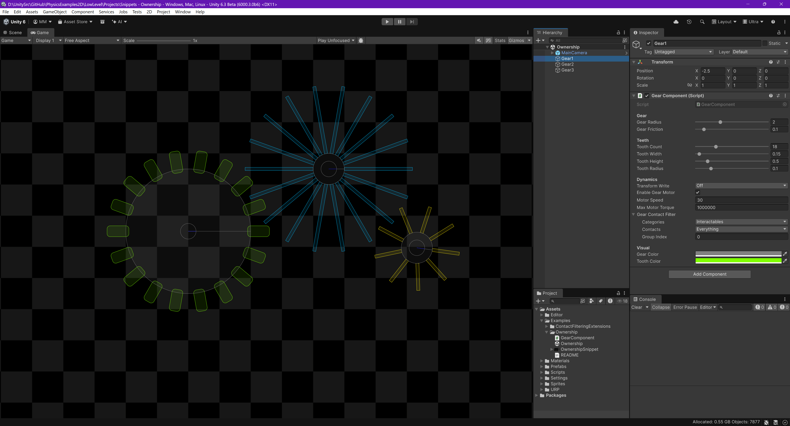

# Using Ownership in Custom Compound Script Components

This snippet shows how you can create compound script components that fully interact with the low-level physics.
In addition, the low-level physics components created i.e. [PhysicsBody], [PhysicsShape] (etc.) are all owned by setting the ownership.
When setting ownership you can (optionally) specify any `UnityEngine.Object` as the owner but more importantly an "owner key" value is returned.
This "owner key" **must** be specified when destroying any of the owner objects by passing it as the second argument to the `Destroy` method for that object.
Using this feature, tight control over the lifetime of objects is provided, stopping casual deleting of the objects from external code.
Attempting to delete such an object will result in a console warning indicating that the object is owned and by which object.

- Load the scene.
- Hit "Play".

The example "Gear" component is very basic but it allows you to configure each gear and does so without the need to expose other components in its construction.
The "gear teeth" are `PhysicsShape` and can be configured to interact with the `PhysicsWorld` as normal.

Much more complex compound components can be created that include unlimited bodies, shapes and joints and can utilise geometry construction or destruction too.
The component may be specific to a project or being made to offer on the Unity Asset Store; such compound components are fully compatible with anything in the scene or anything provided by 3rd parties including Unity.

---

