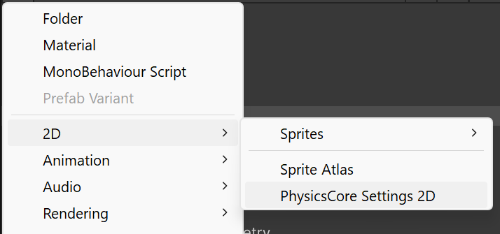
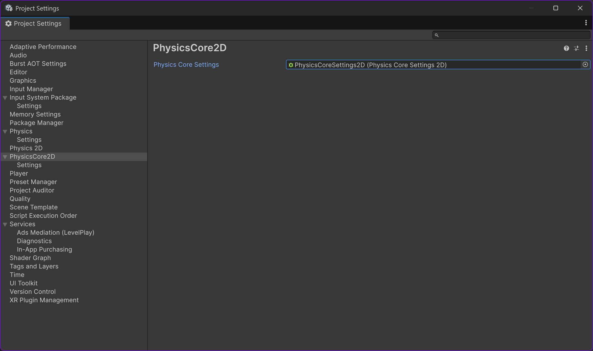
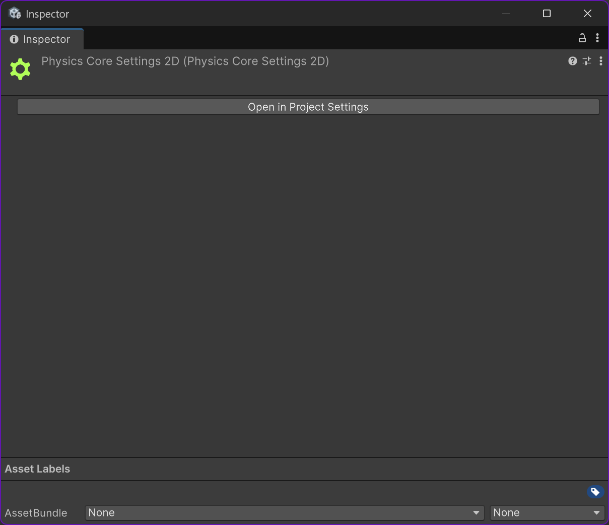
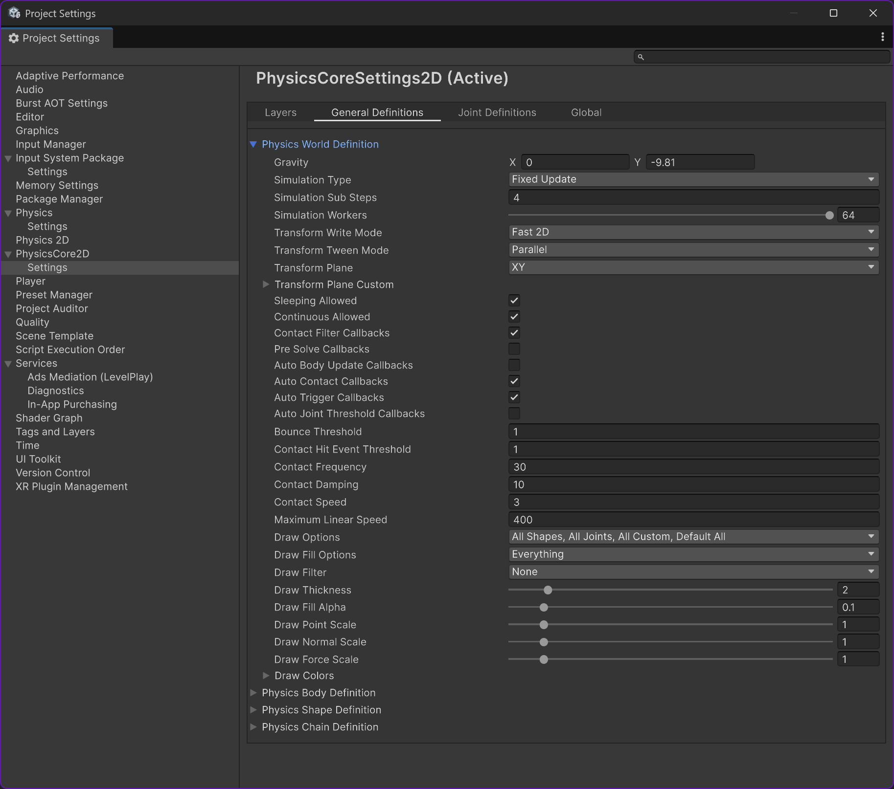

# Physics Settings

The physics system maintains a set of project-wide settings that are applied both in the Editor and at runtime.
These project settings are often useful across multiple projects, so the physics system uses an asset-based approach for configuring and assigning them.
The asset type used to store these settings is [PhysicsCoreSettings2D](https://docs.unity3d.com/6000.5/Documentation/ScriptReference/Unity.U2D.Physics.PhysicsCoreSettings2D.html), which is notably the only `class` type in the API.

## Create and Configure Settings

**Create the Asset**

Go to `Assets > Create > 2D > PhysicsCore Settings 2D` in the Unity Editor:

**Assign the Asset**

Drag the created `PhysicsCore Settings 2D` asset into the property located in `Project Settings > PhysicsCore 2D`:

**Edit the Settings**

Selecting the asset in the `Project` window will allow you to edit its properties in the "Project Settings / Physics Core 2D / Settings" windows but the `Inspector` window will allow you to go directly to the window if it's not already open by clicking on the "Open in Project Settings" button:

You will then be able to edit the properties:

Any changes to this asset will take effect immediately if it is assigned to the project settings:

## Layers

The settings asset lets you configure dedicated physics layer names and provides an option to enable or disable the use of these layers. For more details, see [Physics Layers](PhysicsLayers.md).

## Default Definitions

As outlined in [Definitions](Definitions.md), many physics objects rely on definitions to specify their initial state before creation.
Each definition comes with a configurable set of default values, which are stored in the settings asset.

While definitions are typically used in user scripts, Unity itself also uses a `PhysicsWorldDefinition` when creating the default `PhysicsWorld` (see [PhysicsWorld](PhysicsWorld.md)).
This default definition determines the initial state of the default `PhysicsWorld`.

It's important to note that, as with all physics objects, modifying a definition will not affect any objects that have already been created.
The same principle applies to the `PhysicsWorldDefinition`—changes to it will not impact the existing default `PhysicsWorld`.
Any updates will only take effect after restarting the Editor or re-entering Play mode.

**Caution:** Be mindful when adjusting default definitions.
Your code may depend on certain default values (for example, `PhysicsBody.type` being set to `Static`).
If you change a default, any code that doesn’t explicitly set that property will now use your new default value, potentially resulting in unexpected behavior.

## Globals

A variety of settings are available that directly control the global behavior of the physics system, as well as options specific to player builds. These global settings are generally configured in Editor mode and are not intended to be changed dynamically at runtime.