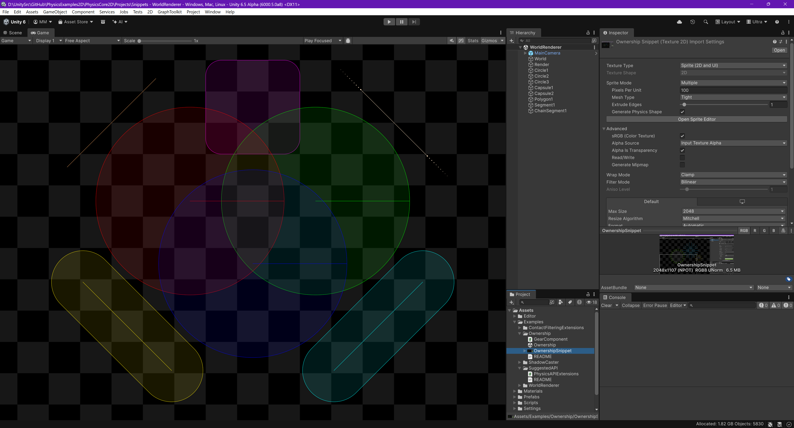

# Using "PhysicsWorld.DrawResults"

This snippet shows how you can consume DrawResults and render using SDF shaders.

- Load the scene.
- Hit "Play".

In the Editor, the DrawResults are already being drawn so when you hit "Play", you'll simply notice overdrawn shapes.
However, if you edit the "PhysicsCoreSettings2D" in the project settings in the "Global" tab, with the "Rendering Mode" set to "Editor Only" then in a player build, the world will not be renderer.  However, if you enable "Always Draw Worlds" then the worlds will always be drawn but not rendered automatically. In this situation, the renderer shown here would render the shapes.

An an alternative to demonstrating that the draw results are indeed being rendered, modify the renderer line-thickness to be x2 what the world specifies then you'll see the thickness change when you hit "Play". Alternately, modify the colors used in the shader to always be white.

---

