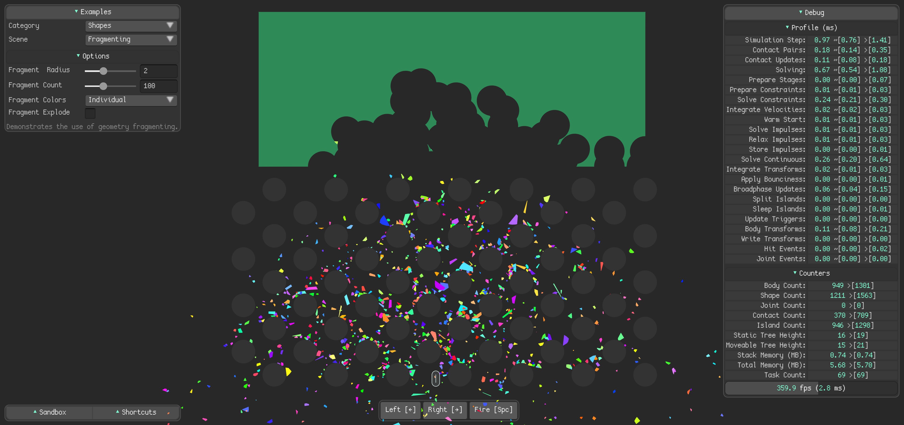

# Physics Core 2D Sandbox

See it on [Unity Play](https://play.unity.com/en/games/dda44876-f374-43c9-a406-1e6b0330316f/sandbox-webgpu-single-thread) (Requires browser WebGPU support and use Unity multi-threaded support but may not offer best performance).

---

This repository contains examples that can be built to a player.

To run, load the main "Sandbox" scene and press "Play". Alternately, build to a player and run.

To change the sample that initially loads when you press "Play", select the "MainMenu" `GameObject` and in the `Sandbox Manager` script, select the sample from the "Start Scene" drop-down.

---

## How a sample is laid out

Every sample is a **single `.cs` file** inside `Assets/Examples/` — no scene file, no subfolders.
A sample's category (the heading it appears under in the menu) comes purely from its code attribute,
so the folder stays flat and the category never drifts out of sync with the file name.

All the repetitive plumbing — finding the shared managers, building the options-menu frame (a single shared `ExampleChrome.uxml`), populating the title/description, hooking up the **Reset** button, framing the camera — lives in one shared base class, **`SandboxExampleBehaviour`**, so each sample's `.cs` file only contains the parts that are actually unique to it. The options panel itself is data-driven: samples add their controls in code via base-class helpers, so there's no per-sample UI file to maintain.

## How a sample's `.cs` script is structured

A sample is a class that **derives from `SandboxExampleBehaviour`** and is tagged with an **`[ExampleScene("Category", "Description")]`** attribute (that attribute is what makes it show up in the menu — see "Adding your own" below). It then fills in only the hooks it needs:

- **`SetupScene()`** *(required)* — Builds the sample: this is where all the physics objects are created. It runs once when the sample loads, and again every time you press the **Reset** button.
- **`SetupOptions()`** *(optional)* — Builds the option controls in code with the base-class helpers — `AddSlider("Speed", value, min, max, v => m_Speed = v, rebuild: true)`, plus `AddSliderInt`/`AddToggle`/`AddEnum` (and `AddElement` for anything custom). The shared menu frame, title and description are already built for you; pass `rebuild: true` when a change should rebuild the scene.
- **`OnExampleEnable()` / `OnExampleDisable()`** *(optional)* — One-time setup and tear-down: initialise fields, save/restore global physics state (like gravity), subscribe/unsubscribe from events, allocate/free native collections.
- **`CameraSize` / `CameraPosition`** *(optional)* — Override these properties to frame the camera for your sample.
- **`Update()`** *(optional)* — Per-frame work, such as drawing debug lines.

You don't write an `OnEnable`/`OnDisable` yourself — the base class owns those and calls the hooks above in the right order.

The `Assets/Framework/Scripts` folder holds shared utility code (e.g. helpers that spawn ragdolls, soft bodies, and other reusable physics objects) used across multiple samples.

## Adding your own

The quickest way is to **copy `Assets/Examples/Example.cs`**, rename the file and the class inside
it, and edit the `[ExampleScene(...)]` category and description. Then run
**`Tools → 2D → Physics → Rebuild Sandbox Registry`** from the Unity menu — that scans for the
`[ExampleScene]` attribute and registers your sample in the menu automatically.

No scene file, no GUIDs, no build-settings editing required.

You can also **ask Claude (Claude Code) to create or modify a sample for you** — "add a sample that…" or "change the X sample to…". It follows the project's authoritative recipe in [`AUTHORING_EXAMPLES.md`](./AUTHORING_EXAMPLES.md), which documents this same pattern in full detail (file-by-file, plus the PhysicsCore2D API rules). That's also the file to read if you'd like the complete reference yourself.

---

